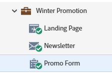

# Genehmigen eines Formulars {#approve-a-form}

Um ein Formular zu einer Landingpage hinzufügen zu können, muss es genehmigt werden.

## Genehmigen eines Formulars {#approve}

So validieren Sie ein vorhandenes Formular, das einsatzbereit ist.

1. Navigieren Sie **[!UICONTROL Marketing-Aktivitäten]**.

   

1. Wählen Sie das gewünschte Formular aus und klicken Sie auf **[!UICONTROL Entwurf genehmigen]**.

   

   Ein grünes Häkchen wird angezeigt.

   

   Sie wurde genehmigt und kann jetzt [zu einer Landingpage hinzugefügt werden](/help/marketo/product-docs/demand-generation/landing-pages/understanding-landing-pages/approve-unapprove-or-delete-a-landing-page.md){target="_blank"}.

   >[!NOTE]
   >
   >Änderungen, die nach der Genehmigung vorgenommen werden, können einige Minuten dauern, bis sie in eingebetteten Formularen aktualisiert werden.

## Genehmigen eines Formulars im Editor {#approve-from-the-editor}

Sie können ein Formular direkt im Formulareditor genehmigen.

>[!PREREQUISITES]
>
>[Bearbeiten eines Formulars](/help/marketo/product-docs/demand-generation/forms/form-actions/edit-a-form.md)

1. Klicken Sie im Formular auf &quot;**[!UICONTROL &quot;]**.

   

1. Klicken Sie **[!UICONTROL Genehmigen und schließen]**.

   
