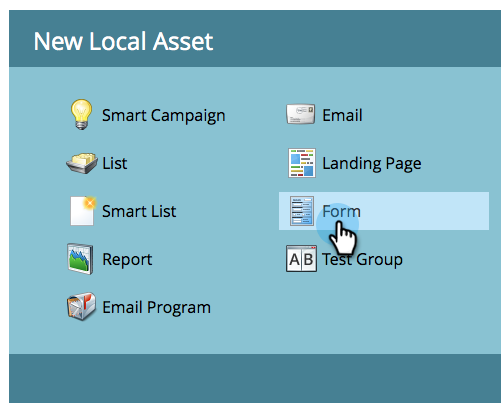

# Formular erstellen {#create-a-form}

Erstellen und Verwenden eines Formulars auf einer Landingpage zum Generieren neuer Namen. Es ist wirklich einfach - hier ist der Einstieg.

>[!NOTE]
>
>Erfahren Sie, was Marketo tut, um [Ihre Formulare sicher zu ](https://nation.marketo.com/t5/Product-Documents/Forms-Service-Enhancements/ta-p/303670#M1038).

1. Navigieren Sie **Marketing-Aktivitäten**.

   

1. Suchen und wählen Sie Ihr **Programm**.

   

1. Klicken Sie unter **Neu** auf **Neu** **Lokal****Asset**.

   

1. Wählen Sie **Formular** aus.

   

1. Geben Sie ein Formular **Name** ein und klicken Sie auf **Erstellen**.

   

>[!TIP]
>
>Die meisten Kunden erstellen für jede Landingpage ein neues Formular. Sie können aber auch ein Formular erstellen, das mit mehreren Landingpages verwendet werden kann. Das hängt ganz von Ihnen ab!

Süß! Nachdem das Formular erstellt wurde, feilen wir an ihm an.

>[!MORELIKETHIS]
>
>* [Formulardesign auswählen](/help/marketo/product-docs/demand-generation/forms/creating-a-form/select-a-form-theme.md)
>* [Hinzufügen eines FieldSet zu einem Formular](/help/marketo/product-docs/demand-generation/forms/form-fields/add-a-fieldset-to-a-form.md)
