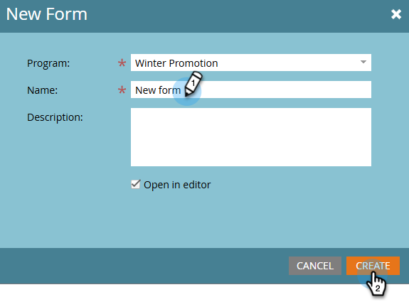

# Erstellen eines Formulars {#create-a-form}

Erstellen und verwenden Sie ein Formular auf einer Landingpage, um neue Namen zu generieren oder die gewünschten Daten zu erfassen.

>[!NOTE]
>
>Erfahren Sie, was Marketo Engage tut, um [Ihre Formulare sicher zu ](https://nation.marketo.com/t5/Product-Documents/Forms-Service-Enhancements/ta-p/303670#M1038).

1. Navigieren Sie zu **[!UICONTROL Marketing-Aktivitäten]**.

   

1. Suchen Sie das gewünschte Programm. Klicken Sie mit der rechten Maustaste darauf und wählen Sie **[!UICONTROL Neues lokales Asset]**.

   

1. Wählen Sie **[!UICONTROL Formular]** aus.

   

1. Geben Sie ein Formular **[!UICONTROL Name]** ein und klicken Sie auf **[!UICONTROL Erstellen]**.

   

>[!TIP]
>
>Die meisten Benutzer erstellen für jede Landingpage ein neues Formular. Sie können aber auch ein Formular erstellen, das mit mehreren Landingpages verwendet werden kann.

>[!MORELIKETHIS]
>
>* [Formulardesign auswählen](/help/marketo/product-docs/demand-generation/forms/creating-a-form/select-a-form-theme.md)
>* [Hinzufügen eines FieldSet zu einem Formular](/help/marketo/product-docs/demand-generation/forms/form-fields/add-a-fieldset-to-a-form.md)
