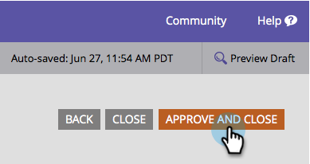

# Feldbezeichnung in einem Formular bearbeiten {#edit-a-field-label-in-a-form}

Sie können die Beschriftung eines Formulars auf alles ändern - Sie können sogar ein Bild verwenden oder es komplett löschen! Hier ist, wie man das macht.

1. Wechseln Sie zu **Marketingaktivitäten**.

   

1. Wählen Sie das Formular aus und klicken Sie auf **Formular bearbeiten**.

   

1. Wählen Sie Ihr Feld aus und bearbeiten Sie dann den **Titel**. Die Felder in den Formulareinstellungen spiegeln die eingegebenen Beschriftungen wider.

   

   >[!TIP]
   >
   >Wenn Sie sich vorstellen möchten, können Sie auf den  klicken. Dadurch wird ein Rich-Text-Editor geöffnet und Sie können mit Bildern, Links und mehr in die Stadt gehen!

1. Klicken Sie auf **Beenden**.

   

1. Klicken Sie auf **Genehmigen und schließen**.

   

>[!NOTE]
>
>Vergessen Sie nicht, [den Landingpage-Entwurf](/help/marketo/product-docs/demand-generation/landing-pages/understanding-landing-pages/approve-unapprove-or-delete-a-landing-page.md) zu genehmigen, der durch die Formularänderungen erstellt wurde.

Da hast du es! Nach und nach werden Sie zum Formularentwickler-Champion.
