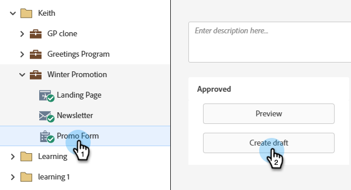

# Bearbeiten einer Feldbezeichnung in einem Formular {#edit-a-field-label-in-a-form}

Sie können die Beschriftung auf einem Formular beliebig ändern - Sie können sogar ein Bild verwenden oder es vollständig löschen! So geht das.

1. Navigieren Sie **[!UICONTROL Marketing-Aktivitäten]**.

   

1. Wählen Sie Ihr Formular aus und klicken Sie auf **[!UICONTROL Entwurf erstellen]**.

   

   >[!NOTE]
   >
   >Wenn Ihr Formular nicht genehmigt ist, klicken Sie auf **Entwurf bearbeiten**.

1. Wählen Sie Ihr Feld aus und bearbeiten Sie dann **[!UICONTROL Bezeichnung]**. Die Felder in den Formulareinstellungen spiegeln die von Ihnen eingegebene(n) Beschriftung(en) wider.

   

   >[!TIP]
   >
   >Klicken Sie auf das -Symbol, um auf den Rich-Text-Editor zuzugreifen.

1. Klicken Sie auf **[!UICONTROL Fertigstellen]**.

   

1. Klicken Sie **[!UICONTROL Genehmigen und schließen]**.

   

>[!NOTE]
>
>Vergessen Sie nicht, den [&#x200B; der Formularänderungen erstellten Landingpage-](/help/marketo/product-docs/demand-generation/landing-pages/understanding-landing-pages/approve-unapprove-or-delete-a-landing-page.md){target="_blank"} zu genehmigen.
