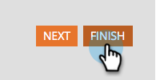

# Festlegen eines Formularfelds als erforderlich {#make-a-form-field-required}

Beim [Hinzufügen von Feldern zu einem &#x200B;](/help/marketo/product-docs/demand-generation/forms/creating-a-form/add-a-field-to-a-form.md){target="_blank"} können Sie einige dieser Felder für die Person, die sie ausfüllt, erforderlich machen.

1. Navigieren Sie zu **[!UICONTROL Marketing-Aktivitäten]**.

   

1. Wählen Sie Ihr Formular aus und klicken Sie auf **[!UICONTROL Entwurf erstellen]**.

   

   >[!NOTE]
   >
   >Wenn das Formular nicht genehmigt ist, klicken Sie auf **Entwurf bearbeiten**.

1. Wählen Sie das Feld aus, das Sie als erforderlich festlegen möchten, und aktivieren Sie **[!UICONTROL Ist erforderlich]**.

   

1. Klicken Sie auf **[!UICONTROL Fertigstellen]**.

   

1. Klicken Sie **[!UICONTROL Genehmigen und schließen]**.

   

>[!NOTE]
>
>Denken Sie daran[&#x200B; alle Landingpages zu genehmigen](/help/marketo/product-docs/demand-generation/landing-pages/understanding-landing-pages/approve-unapprove-or-delete-a-landing-page.md){target="_blank"} Dieses Formular wird weiterverwendet, damit die Änderungen live geschaltet werden können.

>[!MORELIKETHIS]
>
>[Ordnen Sie die Felder, die Sie dem Formular hinzugefügt haben, neu an](/help/marketo/product-docs/demand-generation/forms/form-fields/reorder-fields-in-a-form.md){target="_blank"}
