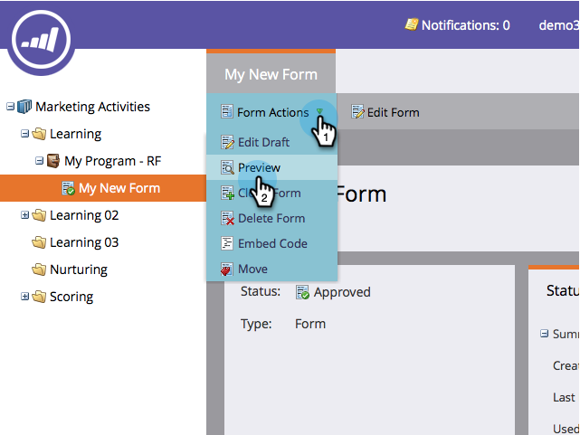

# Vorschau eines Formulars {#preview-a-form}

Vor der Veröffentlichung können Sie das Formular in dieser schnellen und einfachen Formularvorschau sehen.

1. Wechseln Sie zu **Marketingaktivitäten**.

   

1. Wählen Sie das Formular aus.

   

1. Klicken Sie unter &quot;**Formulaaktionen**&quot;auf &quot;**Vorschau**&quot;.

   

1. Der Formular-Editor wird im Modus **Vorschau** geöffnet.

   

1. Klicken Sie auf **Entwurf bearbeiten** , um zum Modus **Bearbeiten** zurückzukehren.

   

1. Wechseln Sie einfach zurück, indem Sie auf **Vorschau für Entwurf anzeigen** klicken.

   

War das nicht einfach? Jetzt wissen Sie, wie Sie Ihr Formular in der Vorschau anzeigen können, wenn Sie Änderungen vornehmen.
