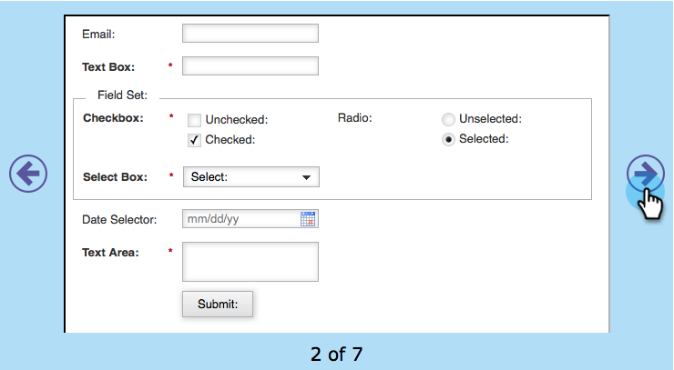

# Formulardesign auswählen {#select-a-form-theme}

Wir haben eine Reihe von schönen Themen für Ihre Formulare erstellt. Was magst du am liebsten?

1. Navigieren Sie **Marketing-Aktivitäten**.

   

1. Wählen Sie Ihr Formular aus und klicken Sie auf **Formular bearbeiten**.

   

1. Navigieren Sie zu **Formulareinstellungen**.

   

1. Schalten Sie vor und zurück, um das **Formular-Design** nach Ihren Wünschen auszuwählen.

   

   Derzeit gibt es 7 integrierte Designs:

   * Einfach
   * Eingelassen
   * Schimmernd
   * Rund
   * Dunkel
   * Schattiert
   * Schlicht

   >[!TIP]
   >
   >Sie können auch [CSS Ihres Formulardesigns bearbeiten](/help/marketo/product-docs/demand-generation/forms/form-design/edit-the-css-of-a-form-theme.md).

1. Klicken Sie auf **Weiter**, um andere Formularoptionen zu konfigurieren, oder klicken Sie auf **Beenden**, wenn Sie nur das Formulardesign ändern möchten.

   

Wie einfach war das?! Sie können Ihr HTML/CSS-Buch jetzt etwas Staub sammeln lassen.

>[!MORELIKETHIS]
>
>* [Bearbeiten des CSS eines Formulardesigns](/help/marketo/product-docs/demand-generation/forms/form-design/edit-the-css-of-a-form-theme.md)
>* [Hinzufügen eines Felds zu einem Formular](/help/marketo/product-docs/demand-generation/forms/creating-a-form/add-a-field-to-a-form.md)
