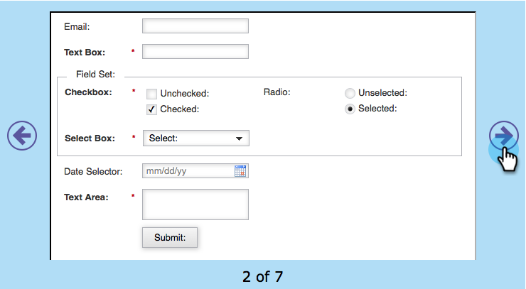

# Auswählen eines Formular-Designs {#select-a-form-theme}

Für Ihre Formulare stehen verschiedene Designs zur Verfügung.

1. Navigieren Sie zu **[!UICONTROL Marketing-Aktivitäten]**.

   

1. Wählen Sie Ihr Formular aus und klicken Sie auf **[!UICONTROL Entwurf erstellen]**.

   

   >[!NOTE]
   >
   >Wenn das Formular nicht genehmigt ist, klicken Sie auf **Entwurf bearbeiten**.

1. Navigieren Sie zu **[!UICONTROL Formulareinstellungen]**.

   

1. Schalten Sie vor und zurück, um das **[!UICONTROL Formular-Design]** nach Ihren Wünschen auszuwählen.

   

   Derzeit gibt es 7 integrierte Designs:

   * Einfach
   * Eingelassen
   * Schimmernd
   * Round
   * Dunkel
   * Schattiert
   * Schlicht

   >[!TIP]
   >
   >Sie können auch [CSS Ihres Formulardesigns bearbeiten](/help/marketo/product-docs/demand-generation/forms/form-design/edit-the-css-of-a-form-theme.md){target="_blank"}.

1. Klicken Sie auf **[!UICONTROL Weiter]**, um andere Formularoptionen zu konfigurieren, oder klicken Sie auf **[!UICONTROL Beenden]**, wenn Sie nur das Formulardesign ändern möchten.

   

>[!MORELIKETHIS]
>
>* [Bearbeiten des CSS eines Formulardesigns](/help/marketo/product-docs/demand-generation/forms/form-design/edit-the-css-of-a-form-theme.md){target="_blank"}
>* [Hinzufügen eines Felds zu einem Formular](/help/marketo/product-docs/demand-generation/forms/creating-a-form/add-a-field-to-a-form.md){target="_blank"}
