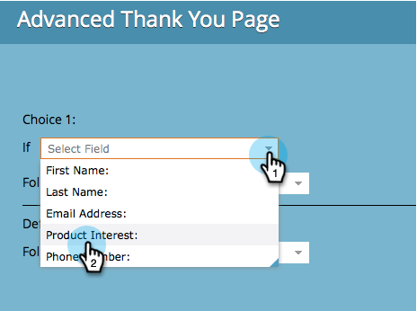
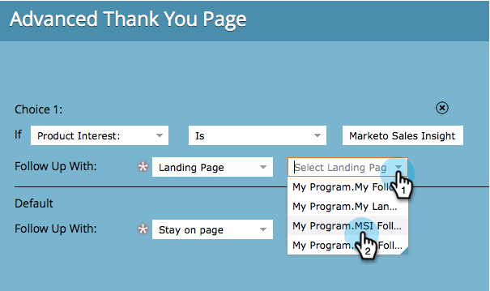

# Formular-Danksagungsseite festlegen {#set-a-form-thank-you-page}

Was passiert, wenn jemand ein Formular ausfüllt? Wo werden sie weitergeleitet? So konfigurieren Sie es.

## Formular bearbeiten {#edit-form}

1. Wechseln Sie zu **Marketingaktivitäten**.

   

1. Wählen Sie das Formular aus und klicken Sie auf **Formular bearbeiten**.

   

1. Klicken Sie unter **Formulaeinstellungen** auf **Einstellungen**.

   

1. Scrollen Sie nach unten zum Abschnitt **Dankeseite** .

## Auf Seite bleiben {#stay-on-page}

Mit der Option &quot;Auf Seite bleiben&quot;bleibt der Besucher auf derselben Seite, auf der das Formular gesendet wurde.

1. Wählen Sie **Auf Seite bleiben** für **Follow-up zu**.

   

## Externe URL {#external-url}

Mit der Einstellung Externe URL können Sie eine beliebige URL als Nachverfolgungsseite definieren. Nachdem der Benutzer das Formular übermittelt hat, wird er an die angegebene URL weitergeleitet.

1. Wählen Sie **Externe URL** für **Follow-up mit** aus.

   

1. Geben Sie die vollständige URL ein.

   

>[!TIP]
>
>Die URL kann die einer Datei sein, die irgendwo gehostet wird. Wenn Sie dies tun, verhält sich die Schaltfläche &quot;Senden&quot;wie eine Schaltfläche &quot;Herunterladen&quot;.

## Landingpage {#landing-page}

Sie können eine beliebige genehmigte Marketo-Landingpage als Folgeseite auswählen.

1. Setzen Sie **Follow-up mit** auf **Landingpage**.

   

1. Wählen Sie die gewünschte Landingpage aus.

   

## Dynamische Dankeseiten {#dynamic-thank-you-pages}

Sie können mehrere Optionen hinzufügen und in Optionen integrieren, um Benutzern je nach Antwort unterschiedliche Folgenachrichten anzuzeigen.

1. Klicken Sie auf **Auswahl hinzufügen**.

   

1. Wählen Sie das Feld aus, dessen Antwort Sie überwachen möchten.

   

   >[!TIP]
   >
   >Hierfür stehen nur die dem Formular hinzugefügten Felder zur Verfügung.

1. Wählen Sie den gewünschten logischen Operator aus.

   

1. Geben Sie einen der Werte ein, mit denen der Benutzer antworten soll.

   

1. Wählen Sie die entsprechende Seite für den Typ **Follow-up mit** aus.

   

1. Wählen Sie die entsprechende Landingpage aus.

   

   >[!NOTE]
   >
   >Sie müssen diese Landingpages zuvor erstellt/genehmigt haben.

1. Klicken Sie auf das Symbol **+** , um eine weitere Auswahl hinzuzufügen.

   

   >[!NOTE]
   >
   >Sie können mehrere Auswahlmöglichkeiten hinzufügen. Wenn Sie jedoch zu viele hinzufügen, kann sich dies auf die Ladegeschwindigkeit des Formulars auswirken, sodass nur das hinzugefügt wird, was Sie benötigen.

1. Gehen Sie durch und richten Sie **Auswahl 2** ein.

   

   >[!TIP]
   >
   >Sie können beliebig verschiedene Folgetypen mischen und abgleichen. Sie können eine Landingpage für eine Auswahl und eine URL für eine andere verwenden.

1. Legen Sie eine Standardseite für alle anderen Antworten fest.

   

1. Wählen Sie die Seite selbst aus und klicken Sie auf **Speichern**.

   

   OK, sieht gut aus!

   

1. Klicken Sie auf **Beenden**.

   

1. Klicken Sie auf **Genehmigen und schließen**.

   

Großartig gemacht!
