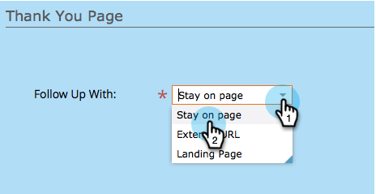

# Einrichten einer Dankeseite für ein Formular {#set-a-form-thank-you-page}

Was passiert, wenn jemand ein Formular ausfüllt? Wohin werden sie weitergeleitet? So wird es konfiguriert.

## Formular bearbeiten {#edit-form}

1. Navigieren Sie **[!UICONTROL Marketing-Aktivitäten]**.

   

1. Wählen Sie Ihr Formular aus und klicken Sie auf **[!UICONTROL Formular bearbeiten]**.

   

1. Klicken Sie unter **[!UICONTROL Formulareinstellungen]** auf **[!UICONTROL Einstellungen]**.

   

1. Scrollen Sie nach unten zum Abschnitt **[!UICONTROL Dankeseite]**.

## Auf Seite bleiben {#stay-on-page}

Mit der Option Auf Seite bleiben bleibt der Besucher auf derselben Seite, wenn das Formular gesendet wurde.

1. Wählen Sie **[!UICONTROL Auf Seite bleiben]** für **[!UICONTROL Follow-up mit]** aus.

   

## Externe URL {#external-url}

Mit der Einstellung Externe URL können Sie eine beliebige URL als Folgeseite definieren. Nachdem der Benutzer das Formular gesendet hat, wird er an die angegebene URL weitergeleitet.

1. Wählen Sie **[!UICONTROL Externe URL]** für **[!UICONTROL Folgenachricht]** aus.

   

1. Geben Sie die vollständige URL ein.

   

>[!TIP]
>
>Die URL kann die einer irgendwo gehosteten Datei sein. In diesem Fall verhält sich die Schaltfläche [!UICONTROL Senden] wie eine Schaltfläche [!UICONTROL Herunterladen].

## Landingpage {#landing-page}

Als Folgemaßnahme können Sie jede genehmigte Marketo-Landingpage auswählen.

1. Legen **[!UICONTROL Folgenachricht mit]** auf &quot;**[!UICONTROL &quot;]**.

   

1. Suchen Sie die gewünschte Landingpage und wählen Sie sie aus.

   

## Dynamische Dankeseiten {#dynamic-thank-you-pages}

Sie können mehrere Optionen hinzufügen und in Optionen integrieren, um Personen je nach ihren Antworten unterschiedliche Folgemaßnahmen anzuzeigen.

1. Klicken Sie **[!UICONTROL Auswahl hinzufügen]**.

   

1. Wählen Sie das Feld aus, dessen Antwort Sie überwachen möchten.

   

   >[!TIP]
   >
   >Hierfür stehen nur Felder zur Verfügung, die dem Formular hinzugefügt wurden.

1. Wählen Sie den gewünschten logischen Operator aus.

   

1. Geben Sie einen der Werte ein, mit denen der Benutzer antworten soll.

   

1. Wählen Sie die entsprechende Seite für den **[!UICONTROL Follow-up mit]**-Typ aus.

   

1. Wählen Sie die entsprechende Landingpage aus.

   

   >[!NOTE]
   >
   >Sie müssen diese Landingpages im Voraus erstellt/genehmigt haben.

1. Klicken Sie auf das **+**, um eine weitere Auswahl hinzuzufügen.

   

   >[!NOTE]
   >
   >Sie können mehrere Auswahlmöglichkeiten hinzufügen. Wenn Sie jedoch zu viele hinzufügen, kann sich dies auf die Ladegeschwindigkeit des Formulars auswirken. Fügen Sie also nur das hinzu, was Sie benötigen.

1. Gehen Sie durch und richten Sie **[!UICONTROL Choice 2]** ein.

   

   >[!TIP]
   >
   >Sie können Folgetypen beliebig kombinieren. Sie können für eine Auswahl eine Landingpage und für eine andere eine URL verwenden.

1. Legen Sie eine Standardseite für alle anderen Antworten fest.

   

1. Wählen Sie die Seite selbst aus und klicken Sie auf **[!UICONTROL Speichern]**.

   

   OK, sieht gut aus!

   

1. Klicken Sie auf **[!UICONTROL Fertigstellen]**.

   

1. Klicken Sie **[!UICONTROL Genehmigen und schließen]**.

   

Großartig gemacht!
