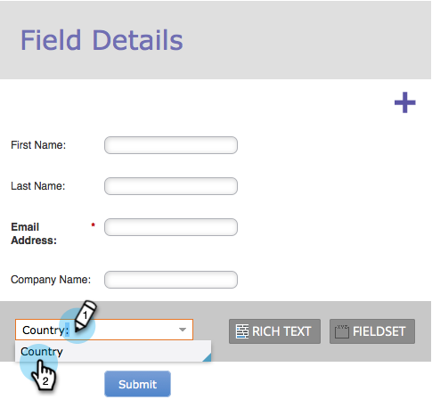
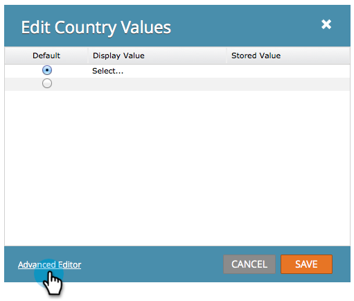

# Hinzufügen einer Länder-Auswahlliste zu Ihrem Formular {#add-a-country-picklist-to-your-form}

Folgen Sie diesen Anweisungen, um das Feld Land in eine Dropdown-Liste mit einer Liste aller Länder zu konvertieren.

1. Navigieren Sie **[!UICONTROL Marketing-Aktivitäten]**.

   

1. Wählen Sie Ihr Formular aus und klicken Sie auf **[!UICONTROL Formular bearbeiten]**.

   

1. Klicken Sie auf das **+**.

   

1. Suchen Sie und wählen Sie **[!UICONTROL Land]** aus.

   

1. Wenn das Feld **[!UICONTROL Land]** ausgewählt ist, ändern Sie **[!UICONTROL Feldtyp]** in **[!UICONTROL Auswählen]**.

   

1. **[!UICONTROL Bearbeiten]** Sie die **[!UICONTROL Werte]**, um die Liste der Länder hinzuzufügen, aus denen Benutzer auswählen können.

   

1. Klicken Sie **[!UICONTROL Erweiterter Editor]**.

   

1. Diese Liste von Ländern auswählen und kopieren:

   ```
   Afghanistan Albania Algeria Andorra Angola Antigua & Deps Argentina Armenia Australia Austria Azerbaijan Bahamas Bahrain Bangladesh Barbados Belarus Belgium Belize Benin Bhutan Bolivia Bosnia Herzegovina Botswana Brazil Brunei Bulgaria Burkina Burundi Cambodia Cameroon Canada Cape Verde Central African Rep Chad Chile China Colombia Comoros Congo Congo (Democratic Rep) Costa Rica Croatia Cuba Cyprus Czech Republic Denmark Djibouti Dominica Dominican Republic East Timor Ecuador Egypt El Salvador Equatorial Guinea Eritrea Estonia Ethiopia Fiji Finland France Gabon Gambia Georgia Germany Ghana Greece Grenada Guatemala Guinea Guinea-Bissau Guyana Haiti Honduras Hungary Iceland India Indonesia Iran Iraq Ireland (Republic) Israel Italy Ivory Coast Jamaica Japan Jordan Kazakhstan Kenya Kiribati Korea North Korea South Kosovo Kuwait Kyrgyzstan Laos Latvia Lebanon Lesotho Liberia Libya Liechtenstein Lithuania Luxembourg Macedonia Madagascar Malawi Malaysia Maldives Mali Malta Marshall Islands Mauritania Mauritius Mexico Micronesia Moldova Monaco Mongolia Montenegro Morocco Mozambique Myanmar (Burma) Namibia Nauru Nepal Netherlands New Zealand Nicaragua Niger Nigeria Norway Oman Pakistan Palau Panama Papua New Guinea Paraguay Peru Philippines Poland Portugal Qatar Romania Russian Federation Rwanda St Kitts & Nevis St Lucia Saint Vincent & the Grenadines Samoa San Marino Sao Tome & Principe Saudi Arabia Senegal Serbia Seychelles Sierra Leone Singapore Slovakia Slovenia Solomon Islands Somalia South Africa South Sudan Spain Sri Lanka Sudan Suriname Swaziland Sweden Switzerland Syria Taiwan Tajikistan Tanzania Thailand Togo Tonga Trinidad & Tobago Tunisia Turkey Turkmenistan Tuvalu Uganda Ukraine United Arab Emirates United Kingdom United States Uruguay Uzbekistan Vanuatu Vatican City Venezuela Vietnam Yemen Zambia Zimbabwe
   ```

1. Einfügen der Liste in den Editor.

   

   >[!TIP]
   >
   >Sie können die Liste bearbeiten oder eine andere Liste verwenden.

1. Klicken Sie auf **[!UICONTROL Speichern]**.

   

1. Klicken Sie auf **[!UICONTROL Fertigstellen]**.

   

1. Klicken Sie **[!UICONTROL Genehmigen und schließen]**.

   

   Gut gemacht! Wenn nun jemand Ihr Formular ausfüllt, kann er aus der von Ihnen angegebenen Liste der Länder auswählen.

   

Da das so einfach war, warum nicht mehr tun? Wie wäre es, das Feld „Bundesstaat“ dynamisch anzuzeigen, wenn ein Benutzer die USA als das Land in der Liste auswählt? Sehen Sie sich den entsprechenden Artikel unten an, um herauszufinden, wie es geht.

>[!MORELIKETHIS]
>
>[Dynamisches Ein-/Ausschalten der Sichtbarkeit eines Formularfelds](/help/marketo/product-docs/demand-generation/forms/form-fields/dynamically-toggle-visibility-of-a-form-field.md)
