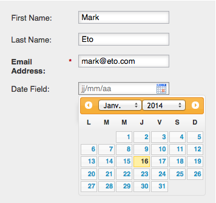

# Gebietsschema eines Formulars ändern {#change-a-forms-locale}

Im Umgang mit internationalen Formularen sollten Sie Daten/Uhrzeit in den richtigen Formaten anzeigen. Marketo wird dies automatisch für Sie tun. Sie müssen lediglich das Gebietsschema des Formulars festlegen und wir kümmern uns um den Rest.

1. Wechseln Sie zu **Marketingaktivitäten**.

   

1. Wählen Sie das Formular aus und klicken Sie auf **Formular bearbeiten**.

   

1. Klicken Sie unter &quot;**Formulareinstellungen**&quot;auf &quot;**Einstellungen**&quot;.

   

1. Wählen Sie das **Gebietsschema** Ihrer Wahl aus.

   

1. Klicken Sie auf **Beenden**.

   

1. Klicken Sie auf **Genehmigen und schließen** , um Änderungen anzuwenden und zu speichern.

   >[!NOTE]
   >
   >Das Formular muss validiert sein, damit es auf Landingpages verwendet werden kann.

   

   >[!NOTE]
   >
   >Denken Sie daran, den durch die Formularänderungen erstellten Landingpage-Entwurf ](/help/marketo/product-docs/demand-generation/landing-pages/understanding-landing-pages/approve-unapprove-or-delete-a-landing-page.md) zu genehmigen.[

   Das ist das! Personen können das Datum/die Uhrzeit im richtigen Gebietsschema anzeigen.

   
