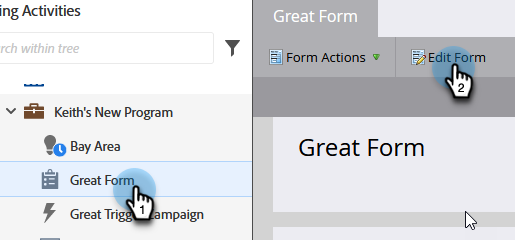

# Ändern der Sprache eines Formulars {#change-the-language-of-a-form}

Erfahren Sie, wie Sie die Sprache Ihres Formulars ändern.

>[!IMPORTANT]
>
>Durch die Schritte in diesem Artikel werden die Sprache von Marketo-Standardfeldern sowie der Wortlaut geändert, der in der Beschriftung der Senden-Schaltfläche verwendet wird. Es werden keine ([ Felder) ](/help/marketo/product-docs/administration/field-management/create-a-custom-field-in-marketo.md){target="_blank"}.

1. Navigieren Sie **Marketing-Aktivitäten**.

   

1. Wählen Sie Ihr Formular aus und klicken Sie auf **Formular bearbeiten**.

   

1. Klicken Sie auf **Formulareinstellungen** und wählen Sie **Einstellungen** aus.

   

1. Wählen Sie die gewünschte **Formularsprache** aus.

   

   OPTIONALER SCHRITT: Wählen Sie das Gebietsschema/die Region Ihrer ausgewählten Sprache.

   

1. Klicken Sie auf **Fertigstellen**.

   

1. Klicken Sie auf **Genehmigen und schließen** um Änderungen anzuwenden und zu speichern.

   

   >[!NOTE]
   >
   >Das Formular muss für die Verwendung auf Landingpages genehmigt sein.

   >[!TIP]
   >
   >Denken Sie daran[ den von den Formularänderungen ](/help/marketo/product-docs/demand-generation/landing-pages/understanding-landing-pages/approve-unapprove-or-delete-a-landing-page.md) Entwurf der Landingpage zu genehmigen.

Im Formular wird nun die von Ihnen ausgewählte Sprache angezeigt.

