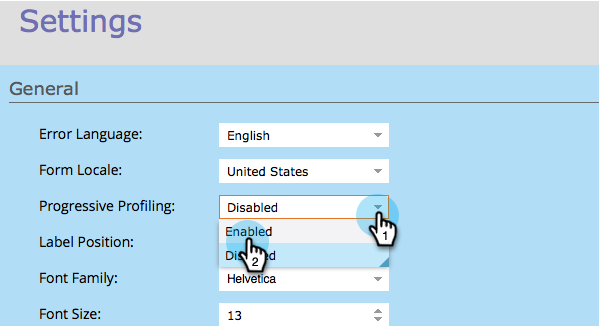
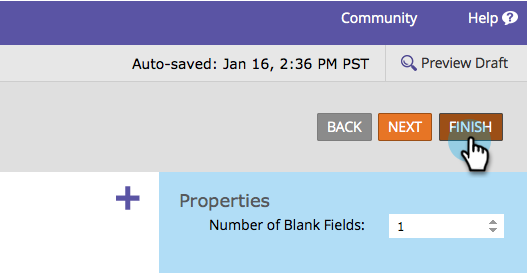

# Konfigurieren der progressiven Formularprofilerstellung {#configure-form-progressive-profiling}

Kurze Formulare sind gut! Wenn jemand zu einem Formular zurückkehrt, können Sie neue Felder präsentieren und schrittweise das Profil des Besuchers ausfüllen. So geht&#39;s.

>[!NOTE]
>
>Damit diese Funktion ordnungsgemäß funktioniert, müssen Sie sicherstellen, dass das Vorausfüllen des Formulars für sichtbare Felder und [deaktiviert](/help/marketo/product-docs/demand-generation/forms/form-fields/disable-pre-fill-for-a-form-field.md) für ausgeblendete Felder aktiviert ist.

1. Navigieren Sie **[!UICONTROL Marketing-Aktivitäten]**.

   

1. Wählen Sie Ihr Formular aus und klicken Sie auf **[!UICONTROL Formular bearbeiten]**.

   

1. Klicken **[!UICONTROL unter &quot;]**&quot; auf **[!UICONTROL Einstellungen]**.

   

1. Legen Sie **[!UICONTROL Progressive Profiling]** auf **[!UICONTROL Aktiviert]** fest.

   

1. Okay, konfigurieren wir es jetzt. Wechseln Sie zu **[!UICONTROL Felddetails]**.

   

1. Ziehen Sie alle Felder, die Teil des progressiven Profilsatzes sind, per Drag-and-Drop.

   

1. Wenn Sie alle Felder verschieben, sollte es in etwa so aussehen:

   

   >[!NOTE]
   >
   >Die Felder außerhalb des Felds **[!UICONTROL Progressive Profiling]** werden immer im Formular angezeigt, auch wenn sie ausgefüllt sind.

1. Aktivieren Sie das **[!UICONTROL Progressive Profiling]**.

   

   >[!CAUTION]
   >
   >Seien Sie vorsichtig, wenn Sie erforderliche Felder in [!UICONTROL Progressive Profiling] verwenden. Diese Felder können weiterhin leer gelassen werden, wenn der Besucher eine neue E-Mail-Adresse eingibt (wodurch eine neue Person erstellt wird), nachdem er zuvor Daten für die anderen Felder übermittelt hat, da diese auf dem neuesten Formular unterdrückt würden.

1. Wählen Sie jetzt aus dem Feld „Progressive Profiling **aus, wie viele leere Felder** Personen gleichzeitig angezeigt werden sollen.

   

   >[!NOTE]
   >
   >Wenn Sie **[!UICONTROL Anzahl leerer Felder]** als 1 auswählen, wird dem Besucher bei der ersten Anzeige dieses Formulars Folgendes angezeigt:
   >
   >* Vorname (leer)
   >* Nachname (leer)
   >* E-Mail-Adresse (leer)
   >* Telefonnummer (leer)
   >
   >Wenn sie jedes Feld ausfüllen, werden sie beim zweiten Besuch Folgendes sehen:
   >
   >* Vorname (vorbefüllt)
   >* Nachname (vorbefüllt)
   >* E-Mail-Adresse (vorbefüllt)
   >* Mobiltelefonnummer (leer)
   >
   >Wenn sie die Mobiltelefonnummer angeben, sehen sie beim dritten Besuch Folgendes:
   >
   >* Vorname (vorbefüllt)
   >* Nachname (vorbefüllt)
   >* E-Mail-Adresse (vorbefüllt)
   >* Land (leer)

1. Klicken Sie auf **[!UICONTROL Fertigstellen]**.

   

1. Klicken Sie **[!UICONTROL Genehmigen und schließen]**.

   

Gute Arbeit! Die Arbeit, die Sie gerade getan haben, wird sich auszahlen.

Experimentieren Sie mit dieser Funktion und stellen Sie sicher, dass Sie sie testen. Es ist sehr fortgeschritten, aber Sie können auf diese Weise Ihre Formulare sehr dynamisch machen.
