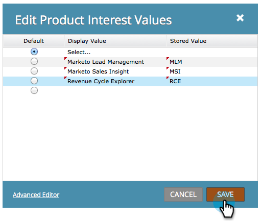

# Definieren von Werten in einem Optionsfeld oder in einem ausgewählten Feld in einem Formular {#define-values-in-a-radio-or-selected-field-in-a-form}

Nachdem Sie [ als Feldtyp ](/help/marketo/product-docs/administration/field-management/change-the-type-of-a-marketo-custom-field.md) ein Optionsfeld oder einen Auswahltyp festgelegt haben, sollten Sie die Werte definieren, aus denen der Benutzer wählen kann. So geht es.

1. Wechseln Sie zu **Marketingaktivitäten**.

   

1. Wählen Sie das Formular aus und klicken Sie auf **Formular bearbeiten**.

   

1. Wählen Sie das Feld aus und klicken Sie auf **Bearbeiten**.

   

   >[!NOTE]
   >
   >Der erste und der Standardwert ist immer &quot;Select..&quot;. Sie können das gerne bearbeiten. Wenn Sie das Standard-Optionsfeld in eine andere Zeile ändern, wird &quot;Auswählen..&quot;nicht als eine Auswahl im Formular angezeigt.

1. Klicken Sie auf , um Ihren Wert hinzuzufügen.

   

   >[!NOTE]
   >
   >**Definition**
   >
   >**Anzeigewert:** Was dem Besucher angezeigt wird.
   >
   >**Gespeicherter Wert:** Was in Marketo aufgezeichnet wird.

1. Fügen Sie so viele Werte hinzu, wie Sie benötigen, und klicken Sie dann auf **Speichern**.

   >[!NOTE]
   >
   >Wenn Sie keinen gespeicherten Wert eingeben, verwendet Marketo den Anzeigewert und speichert ihn.

   

   >[!TIP]
   >
   >Klicken Sie auf **Erweiterter Editor** , um eine Werteliste zu kopieren/einzufügen. Das kann in Echtzeit gerettet werden.

1. Klicken Sie auf **Beenden**.

   

1. Klicken Sie auf **Genehmigen und schließen**.

   

Super! Du machst es wirklich gut.
