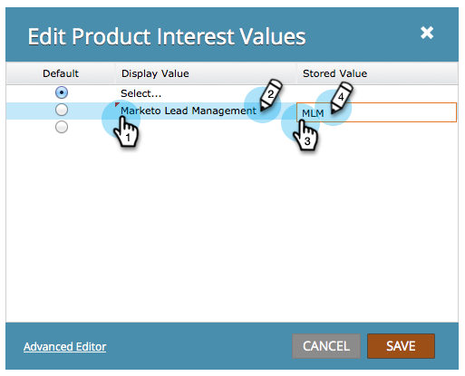

# Definieren von Werten in einem Optionsfeld oder einem ausgewählten Feld in einem Formular {#define-values-in-a-radio-or-selected-field-in-a-form}

Nachdem Sie &quot;[&#x200B; Feldtyp“ &#x200B;](/help/marketo/product-docs/administration/field-management/change-the-type-of-a-marketo-custom-field.md) Optionsfeld- oder Auswahltyp festgelegt haben, sollten Sie die Werte definieren, aus denen der Benutzer auswählen kann. Und so geht das.

1. Navigieren Sie zu **[!UICONTROL Marketing-Aktivitäten]**.

   

1. Wählen Sie Ihr Formular aus und klicken Sie auf **[!UICONTROL Formular bearbeiten]**.

   

1. Wählen Sie das Feld aus und klicken Sie auf **[!UICONTROL Bearbeiten]**.

   

   >[!NOTE]
   >
   >Der erste und standardmäßige Wert ist immer &quot;[!UICONTROL …]&quot; Sie können das gerne bearbeiten. Wenn Sie das Optionsfeld „Standard“ in eine andere Zeile ändern, [!UICONTROL &#x200B; Sie „Auswählen…]&quot; wird im Formular nicht als Auswahl angezeigt.

1. Klicken, um Wert hinzuzufügen.

   

   >[!NOTE]
   >
   >**Definition**
   >
   >**[!UICONTROL Wert anzeigen]:** Was dem Besucher angezeigt wird.
   >
   >**[!UICONTROL Gespeicherter Wert]:** Was in Marketo aufgezeichnet wird.

1. Fügen Sie beliebig viele Werte hinzu und klicken Sie dann auf **[!UICONTROL Speichern]**.

   >[!NOTE]
   >
   >Wenn Sie keinen &quot;[!UICONTROL &#x200B; Wert“ eingeben] verwendet Marketo den [!UICONTROL Wert anzeigen] und speichert diesen.

   

   >[!TIP]
   >
   >Klicken Sie **[!UICONTROL Erweiterter Editor]**, um eine Liste mit Werten zu kopieren/einzufügen. Es kann echtzeitsparend sein.

1. Klicken Sie auf **[!UICONTROL Fertigstellen]**.

   

1. Klicken Sie **[!UICONTROL Genehmigen und schließen]**.

   
