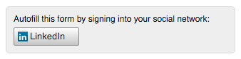

# Häufig gestellte Fragen zur linkedIn Social-Formularbearbeitung {#linkedin-social-form-fill-faqs}

Aufgrund der überarbeiteten API-Richtlinie von linkedIn mussten wir LinkedIn Social-Formulare aus unserem Produkt entfernen.

## Wichtige Dinge zu wissen {#important-things-to-know}

* LinkedIn Social-Formularfüllschaltflächen waren ab dem 28. April 2016 keine Option mehr, um Marketo hinzuzufügen

* Die Schaltfläche &quot;LinkedIn Social-Formularausfüllung&quot;wurde aus allen Formularen entfernt, für die sie aktiviert war.

## Warum wurde diese Funktion aus meinem Marketo-Abonnement entfernt? {#why-was-this-functionality-removed-from-my-marketo-subscription}

LinkedIn hat einige wichtige Änderungen am Entwicklungsprogramm vorgenommen. Im Rahmen dieser Änderungen kann Marketo diese Funktion nicht mehr für Kunden unterstützen.

## Was ist passiert, wenn ich die Schaltflächen zum Ausfüllen von LinkedIn Social-Formularen nicht aus meinen Formularen entfernt habe, für die das Social-Formular aktiviert war? {#what-happened-if-i-didnt-remove-the-linkedin-social-form-fill-buttons-from-my-forms-that-had-social-form-enabled}

Am 28. April 2016 haben wir die Schaltfläche &quot;LinkedIn Social-Formulare ausfüllen&quot;aus Formularen entfernt, für die das Social-Formular noch aktiviert war.

## Ich habe diese Funktion in Formulare eingefügt, seit wir Marketo-Kunde wurden. Woher weiß ich, welche Formulare das LinkedIn Social-Formular ausgefüllt haben? {#i-have-been-inserting-this-functionality-on-forms-since-we-became-a-marketo-customer-how-do-i-know-which-forms-were-using-linkedin-social-form-fill}

Bevor wir diese Änderung vorgenommen haben, haben wir wöchentliche Benachrichtigungen an Ihren Benachrichtigungs-Posteingang mit einer Liste von Formularen gesendet, in denen LinkedIn Social-Formulare ausgefüllt wurden. Diese Warnhinweise sollten Ihnen dabei helfen, herauszufinden, wo Sie diese Funktion verwendet haben.

## Funktionieren die LinkedIn Social-Sharing-Schaltflächen weiterhin? {#do-linkedin-social-sharing-buttons-still-work}

Ja. Die Änderung wirkt sich nur auf die LinkedIn Social-Funktion zum Ausfüllen von Formularen aus.

## Funktionieren Facebook und Twitter Social-Formulare weiterhin? {#do-facebook-and-twitter-social-form-fill-still-work}

Ja. Die Formularfelder für facebook und Twitter Social wurden nicht geändert.

## Ist etwas mit den Daten passiert, die wir bereits über LinkedIn Social Form Fill erfasst haben? {#did-anything-happen-to-the-data-we-already-captured-via-linkedin-social-form-fill}

Nein, diese Daten wurden bereits im Personendatensatz in Marketo gespeichert und waren von dieser Änderung nicht betroffen.

## Wo finde ich weitere Informationen zur API-Richtlinie von LinkedIn? {#where-can-i-find-more-information-about-linkedin-s-api-policy}

Auf diesem Link erfahren Sie mehr über die Änderungen, die LinkedIn an seiner API-Richtlinie vorgenommen hat: [https://developer.linkedin.com/blog/posts/2015/developer-program-changes](https://developer.linkedin.com/blog/posts/2015/developer-program-changes)

## Wie kann ich LinkedIn bei Fragen kontaktieren? {#how-can-i-contact-linkedin-with-questions}

Folgen Sie diesem Link, um LinkedIn über ihre Marketinglösungen zu kontaktieren: [https://business.linkedin.com/marketing-solutions/contact-us](https://business.linkedin.com/marketing-solutions/contact-us)

## Wenn Marketo diese Funktion am 28. April aus meinen Formularen entfernt hat, wurden meine Formulare und die betroffenen Landingpages in den Entwurfsmodus versetzt? {#if-marketo-removed-this-functionality-from-my-forms-on-april-were-my-forms-and-the-affected-landing-pages-put-into-draft-mode}

Nein, Ihre Formulare, aus denen diese Funktion entfernt wurde, blieben veröffentlicht.

## Wenn LinkedIn mein einziges Netzwerk war, ändert sich dadurch das Erscheinungsbild meines Formulars? {#if-linkedin-was-my-only-selected-network-will-this-change-the-appearance-of-my-form}

Nein, wir entfernen nur die LinkedIn-Schaltfläche aus Ihrem Formular. Jedes Mal, wenn die Social-Formularfüllung auf ein Formular angewendet wird, wird darüber ein Container erstellt, der die Schaltflächen zum Ausfüllen von Social-Formularen enthält. Wenn vor dem 28. April 2016 LinkedIn die einzige Option war, ähnelte das Erscheinungsbild des Containers diesem Bild:

Nach dem 28. April 2016 ist jetzt oben in allen Formularen ein leerer Container übrig, in dem die LinkedIn Social-Formularelemente entfernt wurden:

>[!NOTE]
>
>Die obigen Bilder sind beispielsweise nur verfügbar. Dies ist möglicherweise nicht genau die Art, wie der Schaltflächencontainer &quot;Social-Formulare ausfüllen&quot;gerendert wird. Schriftfarbe, -stil usw. Sie haben ausgewählt Einfluss, wie Ihr Container aussieht.

## Wie kann ich den leeren Container über meinem Formular entfernen, wenn LinkedIn mein einziges ausgewähltes Netzwerk war? {#if-linkedin-was-my-only-selected-network-how-can-i-remove-the-empty-container-above-my-form}

Sie können den leeren Container entfernen, indem Sie das Formular bearbeiten, Facebook oder Twitter als Option für die Social-Formularausfüllung auswählen und dann die Auswahl von Facebook oder Twitter als Option für die Social-Formularausfüllung aufheben. Dadurch werden die sozialen Optionen im Container zum Ausfüllen des Formulars zurückgesetzt und aus dem Formular entfernt.
