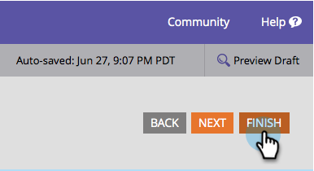

# Position der Formularbeschriftung ändern {#change-form-label-position}

Beim [Erstellen eines Formulars](/help/marketo/product-docs/demand-generation/forms/creating-a-form/create-a-form.md) können Sie die Positionierung der Formularfeldbeschriftungen sehr einfach ändern. So geht es.

1. Wechseln Sie zu **Marketingaktivitäten**.

   

1. Wählen Sie das Formular aus und klicken Sie auf **Formular bearbeiten**.

   

1. Wählen Sie **Einstellungen** aus.

   

1. Wählen Sie die gewünschte **Titelposition** aus.

   

   Sie haben derzeit zwei Optionen:

   * Left (Standard)
   * Oberhalb von

1. Klicken Sie auf **Beenden**.

   

1. Klicken Sie auf **Genehmigen und schließen**.

   >[!NOTE]
   >
   >Das Formular muss validiert sein, damit es auf Landingpages verwendet werden kann.

   

   >[!NOTE]
   >
   >Denken Sie daran, den durch die Formularänderungen erstellten Entwurf der Landingpage zu validieren.

Gut gemacht! Erfahren Sie, wie einfach es war, die Bezeichnungsposition in einem Formular zu ändern? Okay, sehen wir, was wir tun können, um die Schriftart der Formularbeschriftungen zu ändern.

>[!MORELIKETHIS]
>
>[Ändern der Schriftfamilie des Formulars](/help/marketo/product-docs/demand-generation/forms/form-design/change-the-form-font-family.md)
