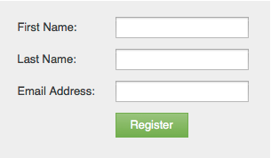

# Schaltflächentext &quot;Formular senden&quot;ändern {#change-form-submit-button-text}

Sie können eine Formularschaltfläche schnell und einfach von &quot;Senden&quot;in ein beliebiges anderes Wort ändern. So geht es.

1. Wechseln Sie zu **Marketingaktivitäten**.

   

1. Wählen Sie das Formular aus und klicken Sie auf **Formular bearbeiten**.

   

1. Wählen Sie die Schaltfläche aus und ändern Sie den **Titel**.

   

   >[!TIP]
   >
   >Beachten Sie, dass Sie auch die Wartebezeichnung ändern können. Dies wird angezeigt, nachdem auf die Schaltfläche geklickt wurde und bevor die Übermittlungsaktion für das Formular abgeschlossen ist.

1. Klicken Sie auf **Beenden**.

   

1. Klicken Sie auf **Genehmigen und schließen**.

   

   Bam!

   
