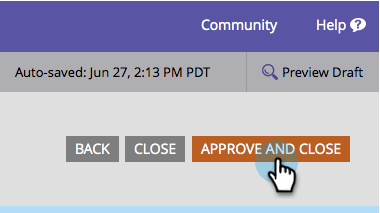

# Text für Senden-Schaltfläche ändern {#change-form-submit-button-text}

Sie können eine Formularschaltfläche schnell und einfach von „Senden“ in ein anderes Wort ändern. So geht&#39;s.

1. Navigieren Sie **Marketing-Aktivitäten**.

   

1. Wählen Sie Ihr Formular aus und klicken Sie auf **Formular bearbeiten**.

   

1. Klicken Sie auf die Schaltfläche und ändern Sie **Beschriftung**.

   

   >[!TIP]
   >
   >Beachten Sie, dass Sie auch die Wartebeschriftung ändern können. Dies wird angezeigt, nachdem auf die Schaltfläche geklickt wurde und bevor die Formularübermittlungsaktion abgeschlossen ist.

1. Klicken Sie auf **Fertigstellen**.

   

1. Klicken Sie **Genehmigen und schließen**.

   

   Bam!

   
