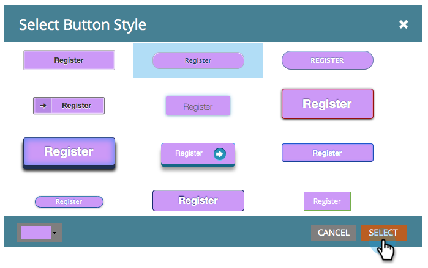
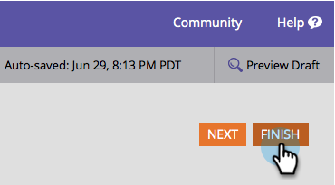
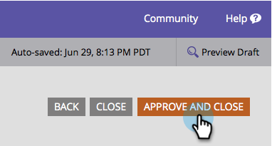

# Ändern von Stil und Farbe der Senden-Schaltfläche {#change-submit-button-style-and-color}

Wenn Sie die standardmäßige Senden-Schaltfläche als langweilig empfinden oder etwas Ausgefalleneres benötigen, können Sie aus einer Vielzahl von einsatzbereiten Schaltflächenstilen wählen.

1. Navigieren Sie zu **[!UICONTROL Marketing-Aktivitäten]**.

   

1. Wählen Sie Ihr Formular aus und klicken Sie auf **[!UICONTROL Formular bearbeiten]**.

   

1. Wählen Sie die Schaltfläche **[!UICONTROL Senden]** und klicken Sie **[!UICONTROL Bearbeiten]** neben Schaltflächenstil.

   

   >[!TIP]
   >
   >Sie können die Senden-Schaltfläche nach links oder rechts ziehen, um ihre Position zu ändern.

1. Schaltflächenstil auswählen (nach oben/unten scrollen)

   

1. Sie können die Farbe als Standard belassen oder anpassen.

   

   >[!TIP]
   >
   >Sie können den Farbcode auch manuell eingeben.

1. Klicken Sie auf **[!UICONTROL Auswählen]**.

   

1. Klicken Sie auf **[!UICONTROL Fertigstellen]**.

   

1. Klicken Sie **[!UICONTROL Genehmigen und schließen]**.

   

   

   >[!NOTE]
   >
   >Wie viele grafische Elemente kann die Schaltfläche je nach verwendetem Browser unterschiedlich aussehen.
