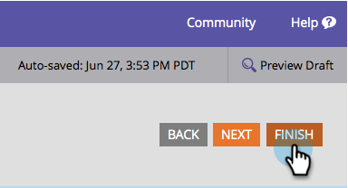

# Ändern der Schriftfamilie eines Formulars {#change-the-form-font-family}

Google Fonts sind in den Formulareditor integriert.

>[!NOTE]
>
>Diese Einstellung wirkt sich auf die Formularbeschriftung, den Eingabetext und jeden Rich-Text aus.

1. Navigieren Sie zu **[!UICONTROL Marketing-Aktivitäten]**.

   

1. Wählen Sie Ihr Formular aus und klicken Sie auf **[!UICONTROL Formular bearbeiten]**.

   

1. Wählen **[!UICONTROL unter &quot;]**&quot; die Option **[!UICONTROL Einstellungen]** aus.

   

1. Wählen Sie **[!UICONTROL gewünschte]** aus.

   >[!TIP]
   >
   >Es stehen eine Reihe von [Google](https://fonts.google.com/){target="_blank"}Schriftarten zur Verwendung zur Verfügung.

   

1. Klicken Sie auf **[!UICONTROL Fertigstellen]**.

   

1. Klicken Sie **[!UICONTROL Genehmigen und schließen]**.

   >[!NOTE]
   >
   >Das Formular muss für die Verwendung auf Landingpages genehmigt sein.

   

   >[!NOTE]
   >
   >Denken Sie daran, den Landingpage-Entwurf zu genehmigen, der durch die Formularänderungen erstellt wurde.

   

>[!MORELIKETHIS]
>
>[Ändern der Schriftgröße des Formulars](/help/marketo/product-docs/demand-generation/forms/form-design/change-the-form-font-size.md)
