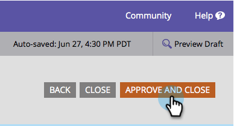

# Ändern der Schriftgröße eines Formulars {#change-the-form-font-size}

Mit Marketo können Sie das Erscheinungsbild Ihrer Formulare einfach anpassen. Eine Möglichkeit ist, die Schriftgröße zu ändern. Und so geht das.

>[!TIP]
>
>Diese Einstellung wirkt sich auf die Formularbeschriftung, den Eingabetext und den Text der Senden-Schaltfläche aus.

1. Navigieren Sie **[!UICONTROL Marketing-Aktivitäten]**.

   

1. Wählen Sie Ihr Formular aus und klicken Sie auf **[!UICONTROL Formular bearbeiten]**.

   

1. Wählen **[!UICONTROL unter &quot;]**&quot; die Option **[!UICONTROL Einstellungen]** aus.

   

1. Wählen Sie die **[!UICONTROL Schriftgröße]** aus.

   

1. Klicken Sie auf **[!UICONTROL Fertigstellen]**.

   

1. Klicken Sie **[!UICONTROL Genehmigen und schließen]**.

   >[!NOTE]
   >
   >Das Formular muss für die Verwendung auf Landingpages genehmigt sein.

   

   >[!NOTE]
   >
   >Denken Sie daran, den Landingpage-Entwurf zu genehmigen, der durch die Formularänderungen erstellt wurde.

   

Ein Stück Kuchen! Du hast das.
