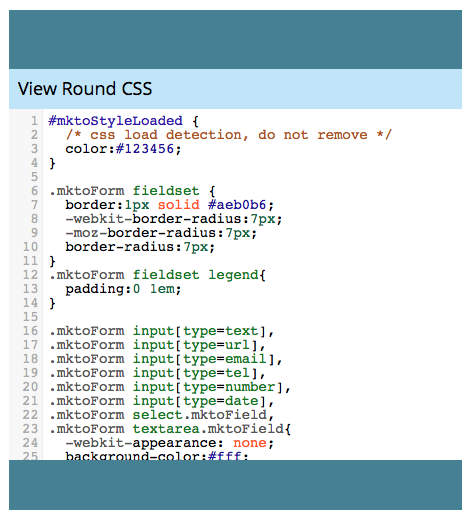

# Bearbeiten der CSS-Datei eines Formulardesigns {#edit-the-css-of-a-form-theme}

Sie haben einige vorgefertigte [Designs, aus denen Sie einfach wählen können](/help/marketo/product-docs/demand-generation/forms/creating-a-form/select-a-form-theme.md). Wenn Sie CSS jedoch gerne bearbeiten, können Sie beliebige Änderungen vornehmen. So geht&#39;s.

>[!NOTE]
>
>Vergewissern Sie sich, dass Sie CSS kennen, wenn Sie dies versuchen möchten, da der Marketo-Support nicht für die Unterstützung bei benutzerdefinierter Kodierung eingerichtet ist. Alle vorgenommenen Änderungen gelten nur für das Formular, das Sie gerade bearbeiten.

1. Navigieren Sie **Marketing-Aktivitäten**.

   

1. Wählen Sie Ihr Formular aus und klicken Sie auf **Formular bearbeiten**.

   

1. Navigieren Sie zu **Formulareinstellungen**.

   

1. Wählen Sie das Design aus, an dem Sie Änderungen vornehmen möchten.

   

1. Klicken Sie unter dem Zahnradsymbol auf **Design-CSS**.

   

1. Sie können diese CSS-Datei auch in Ihren eigenen Editor einfügen. Es ist schreibgeschützt, sodass Sie nur die CSS-Überschreibung benötigen.

   

1. Klicken Sie auf **Schließen**.

   

1. Klicken Sie unter dem Zahnradsymbol auf **Benutzerdefiniertes CSS bearbeiten**.

   

1. Geben Sie Ihr benutzerdefiniertes CSS ein. Man braucht nicht alles, nur die unterschiedlichen Teile.

   

1. Wenn Sie fertig sind, klicken Sie auf **Speichern**.

   

1. Um Ihr angepasstes Formular anzuzeigen, klicken Sie auf **Vorschau des Entwurfs**.

   

Und das war&#39;s!
