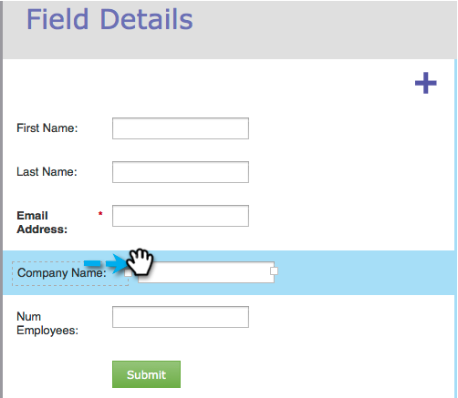

# Ändern der Größe von Beschriftungen/Feldbreiten in einem Formular {#resize-label-field-width-in-a-form}

Es gibt zwei Möglichkeiten, sowohl die Feldbeschriftungsbreite als auch die Feldbreite selbst zu ändern.

## Breite per Drag-and-Drop verschieben {#drag-and-drop-the-width}

1. Wählen [Formular-Editor](/help/marketo/product-docs/demand-generation/forms/form-actions/edit-a-form.md) das Feld aus, dessen Größe Sie ändern möchten.

   

1. Ziehen Sie die Titelecke oder die Feldecke, um die Größe zu ändern.

   

## Breite manuell eingeben {#enter-the-width-manually}

1. Wählen Sie das Feld aus, dessen Größe Sie ändern möchten.

   

1. Geben Sie einen Pixelwert für die [!UICONTROL Titelbreite], die [!UICONTROL Feldbreite] oder beides ein.

   

