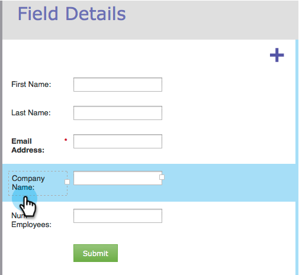

# Ändern der Größe von Beschriftung/Feldbreite in einem Formular {#resize-label-field-width-in-a-form}

Es gibt zwei Möglichkeiten, die Größe sowohl der Feldbeschriftungsbreite als auch der Feldbreite selbst zu ändern.

## Breite ziehen und ablegen {#drag-and-drop-the-width}

1. Wählen Sie im [Formular-Editor](/help/marketo/product-docs/demand-generation/forms/form-actions/edit-a-form.md) das Feld aus, dessen Größe Sie ändern möchten.

   

1. Ziehen Sie die Beschriftungsecke oder die Felderecke, um die Größe zu ändern.

   

## Manuelles Eingeben der Breite {#enter-the-width-manually}

1. Wählen Sie das Feld aus, dessen Größe Sie ändern möchten.

   

1. Geben Sie einen Pixelwert für die Beschriftungsbreite und/oder Feldbreite ein.

   

Gut gemacht! Ziemlich einfach, nicht wahr?
