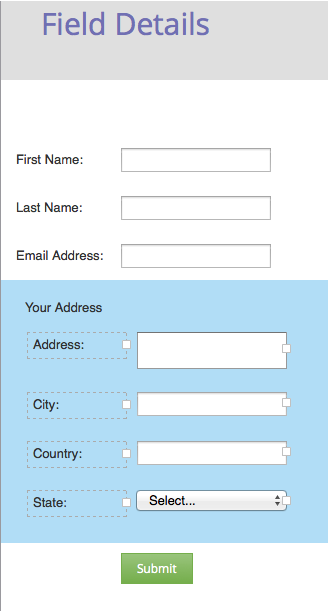

# Hinzufügen eines FieldSet zu einem Formular {#add-a-fieldset-to-a-form}

Feldsätze gruppieren eine Reihe von Feldern zusammen. Sie können einen ganzen Block auf einmal steuern.

1. Navigieren Sie zu **[!UICONTROL Marketing-Aktivitäten]**.

   

1. Wählen Sie Ihr Formular aus und klicken Sie auf **[!UICONTROL Formular bearbeiten]**.

   

1. Klicken Sie auf das **+** und wählen Sie **[!UICONTROL Feldset]** aus.

   

1. Wählen Sie das **Feldset** aus und geben Sie einen **[!UICONTROL Titel]** ein.

   

1. Ziehen Sie die gewünschten Felder in das **fieldset**.

   

1. Die folgende Abbildung zeigt, wie es abschließend aussehen sollte.

   

>[!TIP]
>
>Sie können die gesamte Feldgruppe je nach einem anderen Feld dynamisch aus- oder einblenden. Erfahren Sie mehr [Sichtbarkeitsregeln](/help/marketo/product-docs/demand-generation/forms/form-fields/dynamically-toggle-visibility-of-a-form-field.md).
