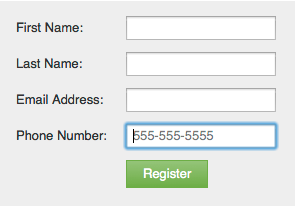

# Hinzufügen von Hinweistext zu einem Formularfeld {#add-hint-text-to-a-form-field}

Hinweise und [Anweisungen](/help/marketo/product-docs/demand-generation/forms/form-fields/add-tooltip-instructions-to-a-form-field.md) helfen beim Ausfüllen von Formularen. So fügt man einen Hinweis hinzu:

>[!NOTE]
>
>**Definition**
>
>Formular **Hinweise** ist Text innerhalb des Felds, der ausgeblendet wird, wenn der Besucher mit der Eingabe in das Feld beginnt.
>
>Formular **Anweisungen** sind kleine QuickInfos, die angezeigt werden, wenn der Besucher den Mauszeiger über das Feld bewegt.

1. Navigieren Sie zu **[!UICONTROL Marketing-Aktivitäten]**.

   

1. Wählen Sie Ihr Formular aus und klicken Sie auf **[!UICONTROL Formular bearbeiten]**.

   

1. Wählen Sie das Feld aus und geben Sie Ihren **[!UICONTROL Hinweistext]** ein.

   

1. Klicken Sie auf **[!UICONTROL Fertigstellen]**.

   

1. Klicken Sie **[!UICONTROL Genehmigen und schließen]**.

   

   >[!NOTE]
   >
   >Vergessen Sie nicht, den [&#x200B; der Formularänderungen &#x200B;](/help/marketo/product-docs/demand-generation/landing-pages/understanding-landing-pages/approve-unapprove-or-delete-a-landing-page.md) Landingpage-Entwurf zu genehmigen.

   

Sieh es dir an! Fahren wir fort und fügen wir jetzt [Anweisungen](add-tooltip-instructions-to-a-form-field.md) hinzu.
