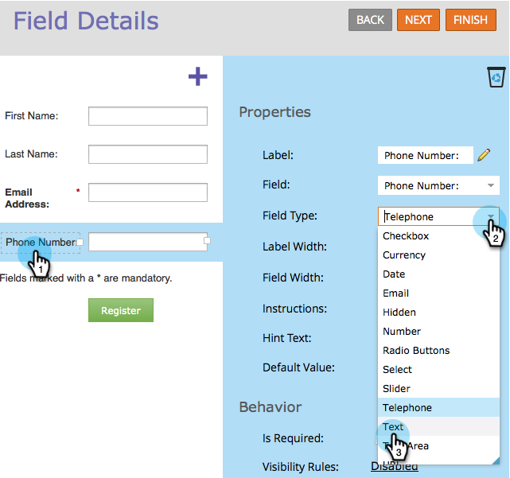
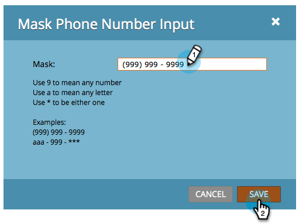

# Anwenden von Eingabemaskierung auf ein Feld in einem Formular {#apply-input-masking-to-a-field-in-a-form}

Sie können die Eingabe Ihres Besuchers mithilfe einer Eingabemaske einschränken. Beispielsweise können Sie möchten, dass Besucherinnen und Besucher Telefonnummern nur in einem bestimmten Format eingeben.

1. Navigieren Sie zu **[!UICONTROL Marketing-Aktivitäten]**.

   

1. Wählen Sie Ihr Formular aus und klicken Sie auf **[!UICONTROL Formular bearbeiten]**.

   

1. Wählen Sie Ihr Feld aus und stellen Sie sicher **[!UICONTROL dass „Feldtyp]***&quot; auf &quot;**[!UICONTROL &quot;]**.

   >[!NOTE]
   >
   >Die Eingabemaskierung funktioniert nur mit **[!UICONTROL Textfeldtypen]**.

   

1. Klicken Sie auf **[!UICONTROL Link]** Maskeneingabe“.

   

1. Geben Sie Ihre Eingabemaske ein und klicken Sie auf **[!UICONTROL Speichern]**.

   

   >[!NOTE]
   >
   >Achten Sie auf die Maskierungsregeln. Sie können die Eingabe auf Zahlen, Buchstaben und beides beschränken und/oder sogar die Anzahl der eingegebenen Zeichen begrenzen.

1. Klicken Sie auf **[!UICONTROL Fertigstellen]**.

   

1. Klicken Sie **[!UICONTROL Genehmigen und schließen]**.

   

   Jetzt bitten Sie den Besucher, Zahlen in einem bestimmten Format einzugeben.

   

   >[!NOTE]
   >
   >Das Feld zeigt möglicherweise keine vordefinierten Bereiche an, wie im Bild oben dargestellt. Er kann leer erscheinen, bis der Besucher mit der Eingabe von Zahlen beginnt, die dann automatisch dem Eingabeformat entsprechen, das Sie für das Feld definiert haben.
