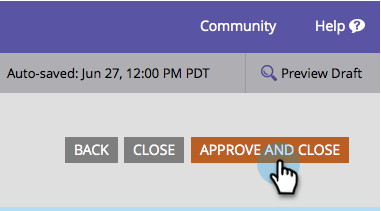

# Löschen eines Felds in einem Formular {#delete-a-field-in-a-form}

Wenn es ein Feld gibt, das Sie nicht mehr in Ihrem Formular benötigen, kann es einfach gelöscht werden. So geht&#39;s.

1. Navigieren Sie **[!UICONTROL Marketing-Aktivitäten]**.

   

1. Wählen Sie das Formular aus und klicken Sie auf **[!UICONTROL Formular bearbeiten]**.

   

1. Wählen Sie Ihr Feld aus und klicken Sie auf das Symbol **[!UICONTROL Löschen]**.

   

1. Klicken Sie auf **[!UICONTROL Fertigstellen]**.

   

1. Klicken Sie **[!UICONTROL Genehmigen und schließen]**.

   

>[!NOTE]
>
>Vergessen Sie nicht, den [ der Formularänderungen ](/help/marketo/product-docs/demand-generation/landing-pages/understanding-landing-pages/approve-unapprove-or-delete-a-landing-page.md) Landingpage-Entwurf zu genehmigen.
