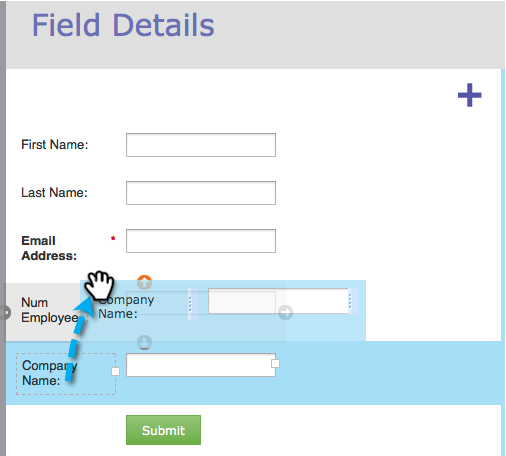

# Neuanordnen von Feldern in einem Formular {#reorder-fields-in-a-form}

Es ist einfach, Felder auf einem Marketo-Formular neu anzuordnen. Und so geht das.

1. Navigieren Sie **[!UICONTROL Marketing-Aktivitäten]**.

   

1. Wählen Sie Ihr Formular aus und klicken Sie auf **[!UICONTROL Formular bearbeiten]**.

   

1. Ziehen Sie die Felder in die gewünschte Reihenfolge.

   

>[!TIP]
>
>Sie können die Felder auch nebeneinander ziehen und ablegen. Dies ermöglicht es Ihnen, Spalten zu erstellen!

Gut gemacht! Du rockst das Ding.
