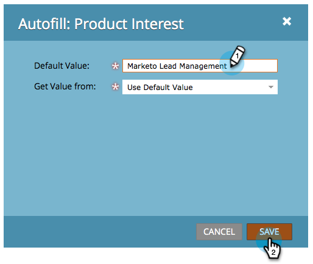

# Wert für ein ausgeblendetes Formularfeld festlegen {#set-a-hidden-form-field-value}

Ausgeblendete Felder werden in der Regel dynamisch ausgefüllt. Sie werden dem Benutzer, der das Formular ausfüllt, nicht angezeigt. So legen Sie den Wert fest:

>[!NOTE]
>
>**Voraussetzungen**
>
>[Formularfelder als ausgeblendet festlegen](set-a-form-field-as-hidden.md)

## Feld auswählen {#select-the-field}

1. Wählen Sie im Formular das ausgeblendete Feld aus und klicken Sie auf **Bearbeiten** für **automatisches Ausfüllen**.

   

## Standardwert verwenden {#use-default-value}

Durch Auswahl von &quot;Standardwert verwenden&quot;können Sie einen bestimmten Wert hartcodieren, der immer verwendet werden soll, wenn dieses Formular gesendet wird. Geben Sie den Standardwert ein und klicken Sie auf Speichern.

## URL-Parameter {#url-parameter}

Wenn Sie beim Ausfüllen des Formulars URL-Parameter (Abfrage-Zeichenfolgen) von der Seite erfassen möchten, auf der sich der Benutzer befindet, können Sie das ausgeblendete Feld mit **URL** - **Parametern** füllen.

>[!NOTE]
>
>Parameter sind eine Art Techie, nicht wahr? Sobald man sie aber bekommt, sind sie mächtig. Diese [Wikipedia-Seite auf Abfrage Strings](http://en.wikipedia.org/wiki/Query_string) ist hilfreich.

1. Wählen Sie **URL-Parameter** für **Abrufwerttyp**.

   

1. Geben Sie den **Parameternamen** ein und klicken Sie auf **Speichern**.

   

>[!TIP]
>
>Sie können einen Standardwert eingeben, falls der URL-Parameter nicht gefunden wird.

## Cookie-Wert {#cookie-value}

Wenn Sie Daten in Cookies speichern, können Sie mit dem **Cookie** - **Wert** Daten beim Senden des Formulars abrufen.

1. Wählen Sie **Cookie** - **Wert** für **Get** **Value** **From**.

   

1. Geben Sie den gewünschten Cookie-Parameternamen ein und klicken Sie auf **Speichern**.

   

   >[!TIP]
   >
   >Sie können einen Standardwert eingeben, falls der Parameter/das Cookie nicht gefunden wird.

## Werber-Parameter {#referrer-parameter}

Wenn Sie Daten von der Seite erfassen möchten, von der der Besucher vor dem Ausfüllen des Formulars kam, können Sie den **Werber** - **Parameter** verwenden.

1. Legen Sie **Get** **Value** **From** to **Werber** **Parameter** fest.

   

1. Geben Sie den **Parameternamen** ein, den Sie aus der Werber-URL entfernen möchten, und klicken Sie auf **Speichern**.

   

   >[!TIP]
   >
   >Sie können einen **Standardwert** **eingeben** , falls der Parameter &quot;Werber&quot;nicht gefunden wird.

1. Klicken Sie auf **Fertig stellen**.

   

1. Klicken Sie auf **Genehmigen und Schließen**.

   

Süß! Du machst das ziemlich gut. Es gibt mehr über [Formulare](http://docs.marketo.com/display/docs/forms)zu lernen.
