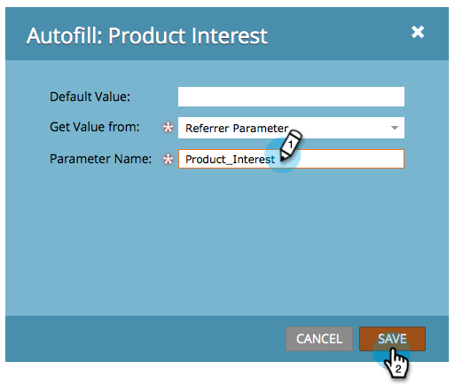

# Wert für ein ausgeblendetes Formularfeld festlegen {#set-a-hidden-form-field-value}

Ausgeblendete Felder werden in der Regel dynamisch ausgefüllt. Sie werden dem Benutzer, der das Formular ausfüllt, nicht angezeigt. So legen Sie den Wert fest:

>[!PREREQUISITES]
>
>[Formularfelder als ausgeblendet festlegen](/help/marketo/product-docs/demand-generation/forms/form-fields/set-a-form-field-as-hidden.md)

## Wählen Sie das Feld {#select-the-field}

1. Wählen Sie im Formular das ausgeblendete Feld aus und klicken Sie auf **Bearbeiten** für **Automatisches Ausfüllen**.

   

## Standardwert {#use-default-value} verwenden

Durch Auswahl von &quot;Standardwert verwenden&quot;können Sie einen bestimmten Wert hartcodieren, der immer verwendet werden soll, wenn dieses Formular gesendet wird. Geben Sie den Standardwert ein und klicken Sie auf Speichern.

## URL-Parameter {#url-parameter}

Wenn Sie URL-Parameter (Abfrage-Zeichenfolgen) von der Seite erfassen möchten, auf der sich der Benutzer beim Ausfüllen des Formulars befindet, können Sie **URL-Parameter** verwenden, um das unsichtbare Feld zu füllen.

>[!NOTE]
>
>Parameter sind eine Art Techie, nicht wahr? Sobald man sie aber bekommt, sind sie mächtig. Diese [Wikipedia-Seite auf Abfrage Strings](https://en.wikipedia.org/wiki/Query_string) ist hilfreich.

1. Wählen Sie **URL-Parameter** für **Werttyp** abrufen.

   

1. Geben Sie **Parametername** ein und klicken Sie auf **Speichern**.

   

>[!TIP]
>
>Sie können einen Standardwert eingeben, falls der URL-Parameter nicht gefunden wird.

## Cookie-Wert {#cookie-value}

Wenn Sie Daten in Cookies speichern, können Sie **Cookie-Wert** verwenden, um Daten beim Senden des Formulars aufzunehmen.

1. Wählen Sie **Cookie-Wert** für **Wert abrufen von**.

   

1. Geben Sie den gewünschten Cookie-Parameternamen ein und klicken Sie auf **Speichern**.

   

   >[!TIP]
   >
   >Sie können einen Standardwert eingeben, falls der Parameter/das Cookie nicht gefunden wird.

## Werber-Parameter {#referrer-parameter}

Wenn Sie Daten von der Seite erfassen möchten, von der der Besucher vor dem Ausfüllen des Formulars stammt, können Sie den Parameter **Werber** verwenden.

1. Legen Sie **Wert abrufen von** auf **Werber-Parameter** fest.

   

1. Geben Sie den **Parameternamen** ein, den Sie aus der Werber-URL entfernen möchten, und klicken Sie auf **Speichern**.

   

   >[!TIP]
   >
   >Sie können einen **Standardwert** eingeben, falls der Werber-Parameter nicht gefunden wird.

1. Klicken Sie auf **Fertigstellen**.

   

1. Klicken Sie auf **Genehmigen und Schließen**.

   
