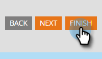

# Aktivieren von CAPTCHA in Marketo Forms {#enable-captcha-in-marketo-forms}

Sie können CAPTCHA für einzelne Formulare aktivieren/deaktivieren.

1. Suchen Sie das gewünschte Formular und wählen Sie es aus.

   

1. Klicken Sie **Entwurf bearbeiten** (wenn das Formular bereits genehmigt ist, klicken Sie auf Entwurf erstellen).

   

1. Klicken Sie **Formulareinstellungen** und dann **Einstellungen**.

   

1. Öffnen Sie die CAPTCHA-Dropdown-Liste und wählen Sie **Aktiviert**.

   

1. Klicken Sie auf **Fertigstellen**.

   

1. Klicken Sie **Genehmigen und schließen**.

   

Es kann einige Minuten dauern, bis Änderungen an dieser Liste aus Google übernommen werden.

>[!NOTE]
>
>In Ihren CAPTCHA-fähigen Formularen wird/werden standardisierter Text eingefügt, einschließlich Links zu den Datenschutzrichtlinien und Nutzungsbedingungen von Google.

>[!MORELIKETHIS]
>
>[Einrichten von reCAPTCHA v3](/help/marketo/product-docs/demand-generation/forms/using-captcha/setting-up-recaptcha-v3.md)
