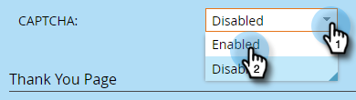
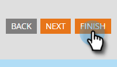

# Aktivieren von CAPTCHA in Marketo-Formularen {#enable-captcha-in-marketo-forms}

Sie können [!UICONTROL CAPTCHA] auf Formularbasis aktivieren oder deaktivieren.

1. Suchen Sie das gewünschte Formular und wählen Sie es aus.

   

1. Klicken Sie **[!UICONTROL Entwurf bearbeiten]** (wenn das Formular bereits genehmigt ist, klicken Sie auf [!UICONTROL Entwurf erstellen]).

   

1. Klicken Sie **[!UICONTROL Formulareinstellungen]** und dann **[!UICONTROL Einstellungen]**.

   

1. Öffnen Sie die **[!UICONTROL CAPTCHA]** Dropdown-Liste und wählen Sie **[!UICONTROL Aktiviert]**.

   

1. Klicken Sie auf **[!UICONTROL Fertigstellen]**.

   

1. Klicken Sie **[!UICONTROL Genehmigen und schließen]**.

   

Es kann einige Minuten dauern, bis Änderungen an dieser Liste aus Google übernommen werden.

>[!NOTE]
>
>In Ihren CAPTCHA-fähigen Formularen wird/werden standardisierter Text eingefügt, einschließlich Links zu den Datenschutzrichtlinien und Nutzungsbedingungen von Google.

>[!MORELIKETHIS]
>
>[Einrichten von reCAPTCHA v3](/help/marketo/product-docs/demand-generation/forms/using-captcha/setting-up-recaptcha-v3.md)
