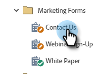

# CAPTCHA in Marketo Forms aktivieren {#enable-captcha-in-marketo-forms}

Sie können CAPTCHA pro Formular aktivieren/deaktivieren.

1. Wählen Sie das gewünschte Formular aus.

   

1. Klicken **Entwurf bearbeiten** (Wenn das Formular bereits genehmigt wurde, klicken Sie auf Entwurf erstellen).

   

1. Klicken **Formulareinstellungen**, dann **Einstellungen**.

   

1. Öffnen Sie die Dropdown-Liste CAPTCHA und wählen Sie **Aktiviert**.

   

1. Klicken **Beenden**.

   

1. Klicken **Genehmigen und schließen**.

   

Es kann einige Minuten dauern, bis Änderungen an dieser Liste von Google übernommen werden.

>[!NOTE]
>
>Google fügt standardisierten Text mit Links zu Datenschutzrichtlinien und Nutzungsbedingungen zu CAPTCHA-fähigen Formularen hinzu.

>[!MORELIKETHIS]
>
>[Einrichten von reCAPTCHA v3](/help/marketo/product-docs/demand-generation/forms/using-captcha/setting-up-recaptcha-v3.md)
