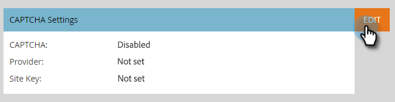

# Einrichten von [!UICONTROL reCAPTCHA v3] {#setting-up-recaptcha-v3}

ReCAPTCHA v3 ist ein reibungsloses Erlebnis, bei dem Formularübermittlungen basierend auf ihrer Misstrauen bewertet werden, ohne dass Text, Bild oder Schaltflächen-Herausforderungen verwendet werden. [Weitere Informationen](https://developers.google.com/search/blog/2018/10/introducing-recaptcha-v3-new-way-to){target="_blank"}.

## Abrufen Ihres [!UICONTROL Rechenzentrums] und Ihrer [!UICONTROL Munchkin ID] {#retrieve-your-data-center-and-munchkin-id}

Für Schritt 6 im Abschnitt [!UICONTROL reCAPTCHA v3]-Ersteinrichtung benötigen Sie die [!UICONTROL Rechenzentrum] und [!UICONTROL Munchkin ID] Ihres Marketo Engage-Abonnements. So finden Sie sie:

1. Klicken Sie in Marketo auf **[!UICONTROL Admin]**.

   

1. Klicken Sie **[!UICONTROL Mein Konto]**.

   

1. Scrollen Sie nach unten zu [!UICONTROL Support-Informationen].

   

## Ersteinrichtung [!UICONTROL reCAPTCHA v3] {#initial-recaptcha-v3-setup}

Die folgenden Schritte werden außerhalb von Marketo ausgeführt.

1. Navigieren Sie zu [https://www.google.com/recaptcha/about/](https://www.google.com/recaptcha/about/){target="_blank"} und klicken Sie auf v3 Admin Console.

1. Mit einem Google-Konto anmelden/anmelden.

1. Klicken Sie auf [!UICONTROL Erstellen] (+), um einen neuen Schlüssel zu erstellen.

1. Erstellen Sie eine Kennzeichnung, die angibt, welcher Schlüssel für Marketo Engage verwendet werden soll.

1. Wählen Sie den Typ **[!UICONTROL reCAPTCHA v3]**. Marketo Engage unterstützt derzeit nicht reCAPTCHA v2.

1. Fügen Sie jede Domain hinzu, die das Marketo Engage-Abonnement verwendet. Domänen, die hier nicht festgelegt sind, geben Fehler bei Formularen zurück, für die reCAPTCHA aktiviert ist. Denken Sie daran, die Wörter „datacenter“ und „munchkinID“ durch &quot;[&#x200B; in Ihrem Abonnement“ zu &#x200B;](#retrieve-your-data-center-and-munchkin-id).

   * app-datacenter.marketo.com
   * munchkinID.mktoweb.com
   * Beliebige Landingpage-Domain und Alias, die im Abonnement konfiguriert sind

   >[!NOTE]
   >
   >Auf die Zulassungsliste setzen Wenn beispielsweise das [!UICONTROL Rechenzentrum“ Ihres Kontos &quot;]&quot; ist, wird die von Ihnen `app-sjst.marketo.com` Domain verwendet. Wenn Ihre [!UICONTROL Munchkin auf die Zulassungsliste setzen ID] 123-ABC-789 ist, wird die Domain, die Sie `123-ABC-789.mktoweb.com` möchten, verwendet.

1. Legen Sie einen Verantwortlichen und eine zusätzliche E-Mail-Adresse fest, die alle Warnungen zu diesem Service erhalten sollen.

1. Akzeptieren Sie die Nutzungsbedingungen von reCAPTCHA.

1. Klicken Sie auf **[!UICONTROL Senden]**.

   >[!NOTE]
   >
   >Halten Sie den Site- und Geheimschlüssel für die Marketo Engage-Konfiguration bereit.

## Einrichten von CAPTCHA in Marketo Engage {#setting-up-captcha-in-marketo-engage}

>[!IMPORTANT]
>
>Nachdem Sie diese Schritte ausgeführt und [CAPTCHA in Ihrem ersten Marketo-Formular aktiviert haben](/help/marketo/product-docs/demand-generation/forms/using-captcha/enable-captcha-in-marketo-forms.md){target="_blank"} sollten Sie das Formular sofort testen, da eine fehlerhafte Konfiguration im reCAPTCHA-Setup das Formular beschädigen kann.

1. Klicken Sie in Marketo auf **[!UICONTROL Admin]**.

   

1. Wählen Sie **[!UICONTROL Struktur]** CAPTCHA) aus.

   

1. Klicken Sie **[!UICONTROL Bearbeiten]** auf [!UICONTROL CAPTCHA]-Einstellungen.

   

1. Klicken Sie auf [!UICONTROL CAPTCHA] Dropdown-Liste und wählen Sie [!UICONTROL reCAPTCHA v3].

   

1. Fügen Sie den **[!UICONTROL Geheimschlüssel]** und den **[!UICONTROL Site-Schlüssel]** ein. Klicken Sie auf **[!UICONTROL Speichern]**, wenn Sie fertig sind.

   

>[!MORELIKETHIS]
>
>[Aktivieren von CAPTCHA in Marketo Forms](/help/marketo/product-docs/demand-generation/forms/using-captcha/enable-captcha-in-marketo-forms.md)
