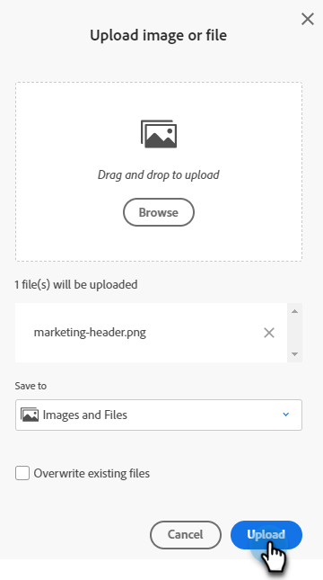

# Hinzufügen von Bildern und Dateien zu Marketo {#add-images-and-files-to-marketo}

Erfahren Sie, wie Sie neue Bilder oder Dateien zu Ihrer Marketo Engage-Instanz hinzufügen.

1. Gehen Sie zum **[!UICONTROL Design Studio]**.

   

1. Wählen Sie **[!UICONTROL Bilder und Dateien]**

   

1. Klicken Sie auf die **[!UICONTROL Bild- und Dateiaktionen]** und wählen Sie **[!UICONTROL Bild oder Datei hochladen]**.

   

1. Ziehen Sie das gewünschte Bild/die gewünschte Datei per Drag-and-Drop oder durchsuchen Sie den Computer danach.

   

   >[!NOTE]
   >
   >Die maximale Größe pro Datei beträgt 100 MB.

1. Nachdem Sie das Asset ausgewählt haben, klicken Sie auf **Hochladen**.

   

   >[!NOTE]
   >
   >Während Marketo alle Dateitypen zum Hochladen akzeptiert, werden nur die wichtigsten Bildtypen (JPG, PNG, GIF usw.) funktioniert im E-Mail-Editor.

   >[!MORELIKETHIS]
   >
   >[Organisieren Sie Ihre Bilder und Dateien mithilfe von Ordnern](/help/marketo/product-docs/demand-generation/images-and-files/organize-your-images-and-files-using-folders.md){target="_blank"}
