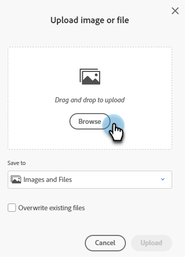

# Hinzufügen von Bildern und Dateien zu Marketo {#add-images-and-files-to-marketo}

Sie haben mehrere Optionen zum Hinzufügen neuer Dateien/Bilder zu Ihrem Images and Files Repository.

## Bild oder Datei hochladen {#upload-image-or-file}

1. Navigieren Sie zu **Design Studio**.

   

1. Auswählen **[!UICONTROL Bilder und Dateien]**

   

1. Klicken Sie auf **[!UICONTROL Bild- und Dateiaktionen]** und wählen Sie **[!UICONTROL Bild oder Datei hochladen]**.

   

1. Ziehen Sie das gewünschte Bild/die gewünschte Datei per Drag-and-Drop oder suchen Sie auf Ihrem Computer danach.

   

1. Nachdem das Asset ausgewählt wurde, klicken Sie auf **Hochladen**.

   

## Bild oder Datei importieren {#import-image-or-file}

Sie haben drei Optionen zum Importieren eines Bildes. Lass uns über jeden von ihnen gehen.

### Import aus dem Internet {#import-from-the-web}

Text

1. Befolgen Sie die Schritte 1 und 2 [von oben](#upload-image-or-file).

1. Klicken Sie auf **[!UICONTROL Bild- und Dateiaktionen]** und wählen Sie **[!UICONTROL Bild oder Datei importieren]**.

   

1. Wählen Sie die **Web** -Option.

   

1. 

PICC

### Aus Feld importieren {#import-from-box}

Text

1. Befolgen Sie die Schritte 1 und 2 [von oben](#upload-image-or-file).

1. Klicken Sie auf **[!UICONTROL Bild- und Dateiaktionen]** und wählen Sie **[!UICONTROL Bild oder Datei importieren]**.

PICC

1. Text

### Importieren von Adobe Experience Manager {#import-from-adobe-experience-manager}

Text

1. Befolgen Sie die Schritte 1 und 2 [von oben](#upload-image-or-file).

1. Klicken Sie auf **[!UICONTROL Bild- und Dateiaktionen]** und wählen Sie **[!UICONTROL Bild oder Datei importieren]**.

PICC

1. Text

ALD DOC....

Es ist einfach, mehrere Bilder und Dateien gleichzeitig hinzuzufügen.

1. Navigieren Sie zu **Design Studio**.

   

1. under **Neu** klicken **Bild hochladen** oder **Datei**.

   

1. Wählen Sie den Ordner aus, in dem Sie die Bilder oder Dateien speichern möchten, und klicken Sie dann auf **Durchsuchen**.

   

   >[!NOTE]
   >
   >Die maximale Dateigröße beträgt 100 MB.

1. Um mehrere Bilder und Dateien hinzuzufügen, navigieren Sie zum richtigen Ordner auf Ihrem Computer und drücken Sie die Eingabetaste **Strg/Befehl** und klicken Sie auf jede Datei, die Sie hinzufügen möchten, und klicken Sie dann auf **Öffnen**.

   

1. Erweitern Sie die **Dateidetails** , um zu überprüfen, dass Sie die richtigen Bilder ausgewählt haben, und klicken Sie dann auf **Hochladen**.

   

   >[!NOTE]
   >
   >Um vor dem Hochladen in der Warteschlange befindliche Dateien zu entfernen, klicken Sie auf das x neben dem Dateinamen.

   >[!TIP]
   >
   >Marketo überprüft alle Dateien vor dem Hochladen. Infizierte Dateien werden übersprungen.

1. Klicken Sie nach Abschluss des Uploads auf **Beenden**.

   

1. Ihre Bilder stehen nun zur Verwendung in Kampagnen-E-Mails und Landingpages zur Verfügung.

   

Schön gemacht!

>[!NOTE]
>
>Marketo akzeptiert zwar alle Dateitypen zum Hochladen, jedoch nur die wichtigsten Bildtypen (JPG, PNG, GIF usw.) in unserem E-Mail-Editor arbeiten.

>[!MORELIKETHIS]
>
>[Organisieren von Bildern und Dateien mithilfe von Ordnern](/help/marketo/product-docs/demand-generation/images-and-files/organize-your-images-and-files-using-folders.md)
