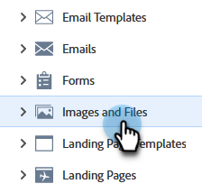

# Suchen der URL eines hochgeladenen Bilds oder einer hochgeladenen Datei {#find-the-url-of-an-uploaded-image-or-file}

Führen Sie diese Schritte aus, um die URL eines Bildes oder einer Datei zu finden, das/die Sie hochgeladen haben.

1. Gehen Sie zum **[!UICONTROL Design Studio]**.

   

1. Klicken Sie auf **[!UICONTROL Bilder und Dateien]**.

   

1. Wählen Sie das gewünschte Asset aus.

   

1. Die **[!UICONTROL URL]** wird auf der Detailseite angezeigt.

   

>[!MORELIKETHIS]
>
>[Ersetzen eines hochgeladenen Bildes oder einer hochgeladenen Datei](/help/marketo/product-docs/demand-generation/images-and-files/replace-an-uploaded-image-or-file.md){target="_blank"}
