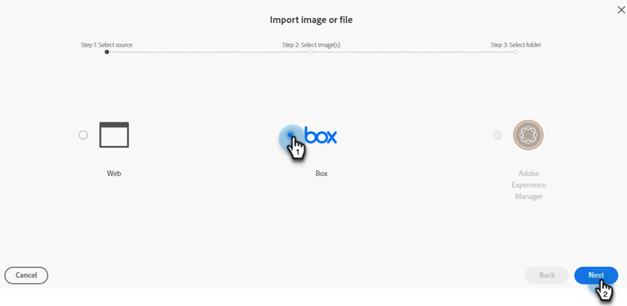

# Neues Dokument Bilder hinzufügen {#new-add-images-doc}

Sie haben mehrere Optionen zum Hinzufügen neuer Dateien/Bilder zu Ihrem Images and Files Repository.

## Bild oder Datei hochladen {#upload-image-or-file}

1. Wechseln Sie zu **Design Studio**.

   

1. Wählen Sie **[!UICONTROL Bilder und Dateien]** aus

   

1. Klicken Sie auf das Dropdown-Menü **[!UICONTROL Bild- und Dateiaktionen]** und wählen Sie **[!UICONTROL Bild oder Datei hochladen]** aus.

   

1. Ziehen Sie das gewünschte Bild/die gewünschte Datei per Drag-and-Drop oder suchen Sie auf Ihrem Computer danach.

   

1. Klicken Sie nach Auswahl des Assets auf **Hochladen**.

   

## Bild oder Datei importieren {#import-image-or-file}

Sie haben drei Optionen zum Importieren eines Bildes. Lass uns über jeden von ihnen gehen.

### Import aus dem Internet {#import-from-the-web}

Text

1. Befolgen Sie die Schritte 1 und 2 [von oben ](#upload-image-or-file).

1. Klicken Sie auf das Dropdown-Menü **[!UICONTROL Bild- und Dateiaktionen]** und wählen Sie **[!UICONTROL Bild oder Datei importieren]** aus.

   

1. Wählen Sie die Option **[!UICONTROL Web]** aus und klicken Sie auf **[!UICONTROL Weiter]**.

   

1. Geben oder fügen Sie die URL zum gewünschten Bild ein und klicken Sie auf **Weiter**.

PICC

1. Klicken Sie auf LEER.

PICC

### Aus Feld importieren {#import-from-box}

Text

1. Befolgen Sie die Schritte 1 und 2 [von oben ](#upload-image-or-file).

1. Klicken Sie auf das Dropdown-Menü **[!UICONTROL Bild- und Dateiaktionen]** und wählen Sie **[!UICONTROL Bild oder Datei importieren]** aus.

   

1. Wählen Sie die Option **[!UICONTROL Feld]** aus und klicken Sie auf **[!UICONTROL Weiter]**.

   

   >[!NOTE]
   >
   >Wenn Sie dies noch nicht getan haben, werden Sie aufgefordert, sich bei Ihrem Box-Konto anzumelden, um Zugriff zu gewähren.

1. Wählen Sie den gewünschten Ordner Box aus und klicken Sie auf **[!UICONTROL Weiter]**.

   

1. Wählen Sie die gewünschten Bilder aus und klicken Sie auf **[!UICONTROL Weiter]**.

   

1. Wählen Sie den Ordner Marketo Engage aus, in dem das Bild gespeichert werden soll. In diesem Beispiel belassen wir es als Bilder und Dateien (Standard). Klicken Sie auf **Importieren**.

   

### Importieren von Adobe Experience Manager {#import-from-adobe-experience-manager}

Text

1. Befolgen Sie die Schritte 1 und 2 [von oben ](#upload-image-or-file).

1. Klicken Sie auf das Dropdown-Menü **[!UICONTROL Bild- und Dateiaktionen]** und wählen Sie **[!UICONTROL Bild oder Datei importieren]** aus.

   

1. Wählen Sie die Option **[!UICONTROL Adobe Experience Manager]** aus und klicken Sie auf **[!UICONTROL Weiter]**.

   

   >[!NOTE]
   >
   >Wenn Sie dies noch nicht getan haben, werden Sie aufgefordert, sich bei Ihrem AEM-Konto anzumelden.

1. Text

PICC

1. Text

PICC

1. Text
