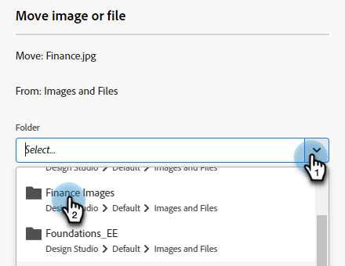

# Anordnen von Bildern und Dateien mithilfe von Ordnern {#organize-your-images-and-files-using-folders}

Durch das Erstellen von Ordnern können Sie Bilder und Dateien verschieben, die gewünschten Bilder anzeigen und direkt in einen bestimmten Ordner hochladen.

1. Gehen Sie zum **[!UICONTROL Design Studio]**.

   

1. Klicken Sie mit der rechten Maustaste auf **[!UICONTROL Bilder und Dateien]** und wählen Sie **[!UICONTROL Neuer Ordner]**.

   

1. Benennen Sie Ihren Ordner und klicken Sie auf **[!UICONTROL Erstellen]**.

   

1. Gehen Sie zurück zu **[!UICONTROL Bilder und Dateien]** und wählen Sie das Asset aus, das Sie verschieben möchten. Klicken Sie auf die **[!UICONTROL Bild- und Dateiaktionen]** und wählen Sie **[!UICONTROL Verschieben]**.

   

1. Wählen Sie den gewünschten Ordner aus.

   

1. Klicken Sie auf **Mmove**.

   

>[!MORELIKETHIS]
>
>[Hochgeladene Bilder und Dateien durchsuchen](/help/marketo/product-docs/demand-generation/images-and-files/search-uploaded-images-and-files.md){target="_blank"}
