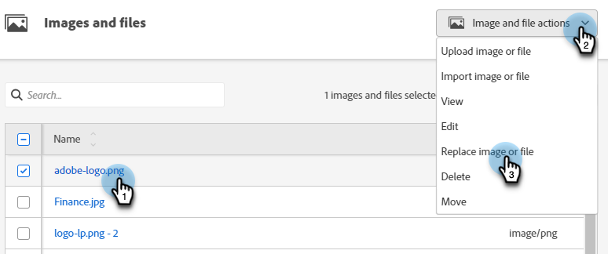

# Ersetzen eines hochgeladenen Bildes oder einer Datei {#replace-an-uploaded-image-or-file}

1. Navigieren Sie zu **[!UICONTROL Design Studio]**.

   

1. Klicks **[!UICONTROL Bilder und Dateien]**.

   

1. Wählen Sie das Asset aus, das Sie ersetzen möchten. Klicken Sie auf **[!UICONTROL Bild- und Dateiaktionen]** und wählen Sie **[!UICONTROL Bild oder Datei ersetzen]**.

   

1. Ziehen Sie den Computer per Drag-and-Drop oder durchsuchen Sie ihn nach der Ersatzdatei.

   

   >[!NOTE]
   >
   >Der Ersetzungsdateityp muss mit dem ursprünglichen Dateityp (z. B. .jpg) übereinstimmen.

1. Klicken Sie nach Auswahl der Ersatzdatei auf **[!UICONTROL Ersetzen]**.

   

   >[!NOTE]
   >
   >Der Name der Ersatzdatei ändert sich entsprechend dem Namen der vorherigen Datei.

Gute Arbeit!

>[!MORELIKETHIS]
>
>* [Hochgeladene Bilder und Dateien durchsuchen](/help/marketo/product-docs/demand-generation/images-and-files/search-uploaded-images-and-files.md){target="_blank"}
>* [Suchen der URL eines hochgeladenen Bildes oder einer hochgeladenen Datei](/help/marketo/product-docs/demand-generation/images-and-files/find-the-url-of-an-uploaded-image-or-file.md){target="_blank"}
