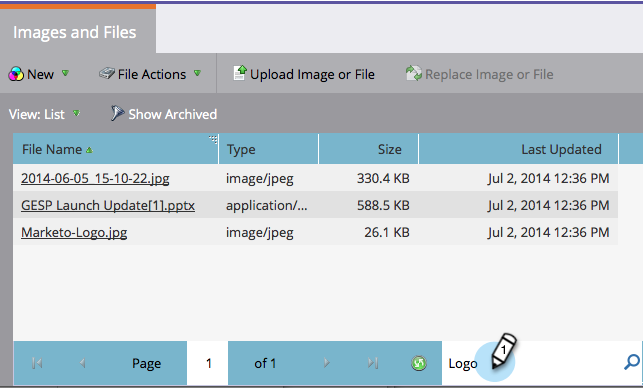

# Hochgeladene Bilder und Dateien suchen {#search-uploaded-images-and-files}

In Marketo ist das Suchen von Bildern und Dateien ein Kinderspiel.

1. Wechseln Sie zu **Design Studio**.

   

1. Klicken Sie auf **Bilder und Dateien**, um eine vollständige Liste aller hochgeladenen Dateien anzuzeigen.

   

1. Geben Sie im Feld **Schnellsuche** unten im Bildschirm den Namen der gesuchten Datei ein und klicken Sie auf **Geben Sie** ein.

   

>[!TIP]
>
>Um eine neue Suche Beginn, klicken Sie im Feld **Schnellsuche** auf **x**.

Nimm deine Füße auf! Du bist fertig!

>[!MORELIKETHIS]
>
>* [Hochgeladene Bilder oder Dateien ersetzen](/help/marketo/product-docs/demand-generation/images-and-files/replace-an-uploaded-image-or-file.md)
>* [Bilder und Dateien mithilfe von Ordnern organisieren](/help/marketo/product-docs/demand-generation/images-and-files/organize-your-images-and-files-using-folders.md)

