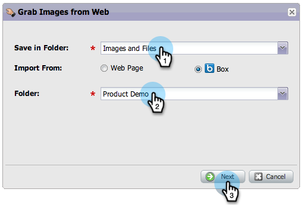

# Hochladen von Bildern und Dateien aus Box {#upload-images-and-files-from-box}

Sie können Dateien von Box hochladen, um sie auf Landingpages und E-Mails zu verwenden.

1. Wechseln Sie zu **[!UICONTROL Design Studio]**.

   

1. Navigieren Sie zu **[!UICONTROL Bilder und Dateien]**. Klicken Sie auf **[!UICONTROL Dateiaktionen]** und wählen Sie **[!UICONTROL Bilder aus dem Web]**.

   

1. Klicken Sie auf **[!UICONTROL Box]**.

   

1. Geben Sie Ihre [!DNL Box] ein.

   

1. Marketo Zugriff auf Ihr [!DNL Box]-Konto gewähren.

   

1. Wählen Sie aus, wo Sie die Dateien speichern möchten. Wählen Sie dann den **[!DNL Box]** Ordner aus, aus dem Sie den Upload durchführen möchten. Klicken Sie auf **[!UICONTROL Weiter]**.

   

1. Wählen Sie die Dateien aus, die Sie hochladen möchten. Klicken Sie **[!UICONTROL Importieren]**.

   

Ihre Dateien können jetzt auf Ihren Landingpages und E-Mails verwendet werden!
