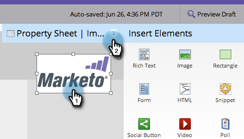
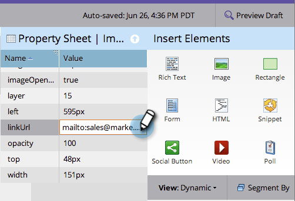

# Hinzufügen eines Links zu einem Freiform-Landingpage-Bild {#add-a-link-to-a-free-form-landing-page-image}

>[!PREREQUISITES]
>
>[Hinzufügen eines Bildes zu einer Freiform-Landingpage](/help/marketo/product-docs/demand-generation/landing-pages/free-form-landing-pages/add-an-image-to-a-free-form-landing-page.md)

>[!NOTE]
>
>Dies gilt nur für Freiform-Landingpages.

1. Wählen Sie das Bild aus, das Sie Ihrer Landingpage hinzugefügt haben, und erweitern Sie das **[!UICONTROL Eigenschaftenblatt].**

   

1. Geben Sie Ihren mailto-Link in das Feld **[!UICONTROL linkUrl] ein.**

   

   Tolle Arbeit! Sie haben jetzt ein Bild als Mailto-Link auf Ihrer Marketo-Landingpage.

   
