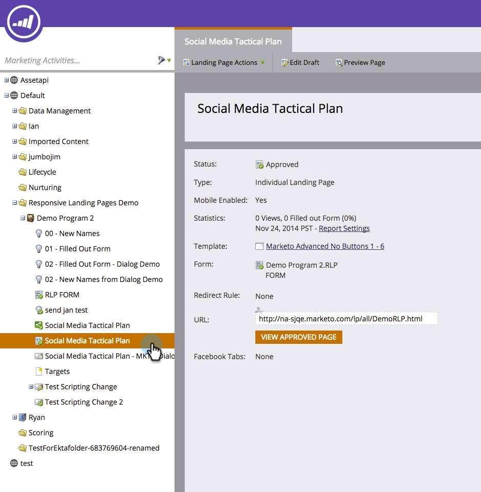

# Eine Mobile-Ansicht für Ihre Freiform-Landingpage hinzufügen {#add-a-mobile-view-for-your-free-form-landing-page}

Es ist einfach, Ihre freien Landingpages auf einem Smartphone großartig aussehen zu lassen.

>[!NOTE]
>
>Die Mobile-Ansicht funktioniert auf Bildschirmen mit einer Breite von 480 Pixel (oder weniger). Mit anderen Worten: Smartphones. Hier finden Sie weitere [Informationen zu Geräteauflösungen](https://www.mydevice.io/).

1. Wechseln Sie zu **Marketingaktivitäten**.

   

1. Wählen Sie eine freie Landingpage aus.

   

1. Klicken Sie auf **Entwurf bearbeiten**.

   

1. Klicken Sie auf die Registerkarte **Mobil**.

   

1. Klicken Sie auf **Aktivieren**.

   

   >[!CAUTION]
   >
   >Möglicherweise muss die Freiformvorlage aktualisiert werden. Wenn Sie diese Nachricht sehen, lesen Sie schnell, wie Sie [eine vorhandene Freiform-Landingpage-Vorlage für Mobilgeräte kompatibel machen](/help/marketo/product-docs/demand-generation/landing-pages/landing-page-templates/make-an-existing-free-form-landing-page-template-mobile-compatible.md).

1. Sehr gut! Sie haben jetzt die mobile Version Ihrer Landingpage aktiviert. Klicken Sie auf **Schließen**.

   

   Sie können jetzt [Ihre Mobile-Ansicht anpassen](/help/marketo/product-docs/demand-generation/landing-pages/free-form-landing-pages/customize-mobile-view-for-your-free-form-landing-page.md).

   
