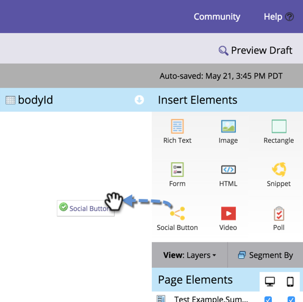

# Hinzufügen einer Social-Media-Schaltfläche zu einer Freiform-Landingpage {#add-a-social-button-to-a-free-form-landing-page}

Eine soziale Schaltfläche ermutigt Personen, Ihre Inhalte mit ihren Freunden zu teilen. Legen Sie sie auf Freiform-Landingpages, in Facebook und auf Ihrer Website ab.

>[!AVAILABILITY]
>
>Nicht alle Marketo Engage-Benutzer haben diese Funktion erworben. Weitere Informationen erhalten Sie beim Adobe Account Team (Ihrem Account Manager).

1. Navigieren Sie zu Ihrer Freiform-Landingpage und klicken Sie auf **Entwurf**.

   

1. Ziehen Sie über **Social**-Schaltfläche von den Elementen auf der rechten Seite.

   

1. Wählen Sie **Social-Schaltflächen (mit Analytics)** aus.

   

   Sobald Ihre Landingpage aktiv ist, sehen Sie sich die Aktivität an, die von Ihrer Social-Media-Schaltfläche (mit Analytics) im [Social-Dashboard) generiert ](/help/marketo/product-docs/demand-generation/social/social-functions/view-social-performance.md).

   Wenn Sie stattdessen eine Schaltfläche Gefällt mir/Empfohlen (Lite) hinzufügen, lesen Sie die Anzahl der Shares im [Landingpage-Leistungsbericht](/help/marketo/product-docs/demand-generation/landing-pages/understanding-landing-pages/landing-page-performance-report.md).

1. Wählen **Neu erstellen** aus dem Dropdown-Menü aus.

   >[!NOTE]
   >
   >Sie können auch eine Social-Media-Schaltfläche in einem Programm erstellen, indem Sie **Neu** > **Neues lokales Asset** auswählen.

1. Benennen Sie Ihre Social-Media-Schaltfläche, wählen Sie **Keine** unter **Klonen aus** aus und klicken Sie auf **Einfügen**.

   

   >[!TIP]
   >
   >Um Zeit zu sparen, können Sie die Option **Klonen von** verwenden, um alle Einstellungen aus einer vorhandenen Social-Media-Schaltfläche zu kopieren.

   [Landingpage in Facebook veröffentlichen](/help/marketo/product-docs/demand-generation/facebook/publish-landing-pages-to-facebook.md) [Schaltfläche Social auf Ihrer Website platzieren](/help/marketo/product-docs/demand-generation/social/social-functions/deploy-social-on-your-website.md)

Herzlichen Glückwunsch! Sie haben Ihrer Landingpage eine Social-Media-Schaltfläche hinzugefügt. Stellen Sie sicher, dass Sie die Landingpage genehmigen.

>[!MORELIKETHIS]
>
>Sie sind fertig, können jedoch bei Bedarf die Einstellungen Ihrer Social-Media-Schaltfläche ändern. Beginnen Sie mit [Anpassen des Schaltflächenstils](/help/marketo/product-docs/demand-generation/social/configuring-social-actions/customize-social-app-button.md) oder [Bearbeiten der ](/help/marketo/product-docs/demand-generation/social/configuring-social-actions/configure-social-sign-up-share-flow.md).
