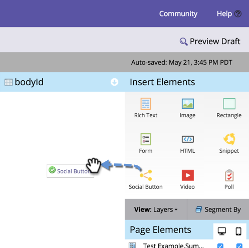
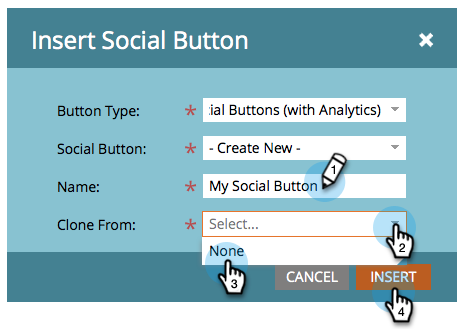

# Hinzufügen einer Social-Media-Schaltfläche zu einer Freiform-Landingpage {#add-a-social-button-to-a-free-form-landing-page}

Eine soziale Schaltfläche ermutigt Personen, Ihre Inhalte mit ihren Freunden zu teilen. Legen Sie sie auf Freiform-Landingpages, auf Facebook und auf Ihrer Website ab.

>[!AVAILABILITY]
>
>Nicht alle Marketo Engage-Benutzer haben diese Funktion erworben. Weitere Informationen erhalten Sie beim Adobe Account Team (Ihrem Account Manager).

1. Navigieren Sie zu Ihrer Freiform-Landingpage und klicken Sie auf **[!UICONTROL Entwurf]**.

   

1. Ziehen Sie über **[!UICONTROL Social]**-Schaltfläche von den Elementen auf der rechten Seite.

   

1. Wählen Sie **[!UICONTROL Social-Schaltflächen (mit Analytics)]** aus.

   

   Sobald Ihre Landingpage aktiv ist, können Sie die von Ihrer Social-Media-Schaltfläche generierte Aktivität (mit Analytics) im Social-Media-Dashboard anzeigen.

   Wenn Sie stattdessen eine Schaltfläche [!UICONTROL Gefällt mir/Empfohlen (Lite] hinzufügen, finden Sie weitere Informationen unter Anzahl der Shares im [Landingpage-Leistungsbericht](/help/marketo/product-docs/demand-generation/landing-pages/understanding-landing-pages/landing-page-performance-report.md).

1. Wählen **[!UICONTROL Neu erstellen]** aus dem Dropdown-Menü aus.

   >[!NOTE]
   >
   >Sie können auch eine Social-Media-Schaltfläche in einem Programm erstellen, indem Sie **[!UICONTROL Neu]** > **[!UICONTROL Neues lokales Asset]** auswählen.

1. Benennen Sie Ihre Social-Media-Schaltfläche, wählen Sie **[!UICONTROL Keine]** unter **[!UICONTROL Klonen aus]** aus und klicken Sie auf **[!UICONTROL Einfügen]**.

   

   >[!TIP]
   >
   >Um Zeit zu sparen, können Sie die Option **[!UICONTROL Klonen von]** verwenden, um alle Einstellungen aus einer vorhandenen Social-Media-Schaltfläche zu kopieren.

1. Veröffentlichen Sie die Landingpage [auf Facebook](/help/marketo/product-docs/demand-generation/facebook/publish-landing-pages-to-facebook.md) und fügen Sie den Social Button auf Ihrer Website ein.

Sie haben Ihrer Landingpage eine Social-Media-Schaltfläche hinzugefügt. Genehmigen Sie die Landingpage, wenn Sie bereit sind.
